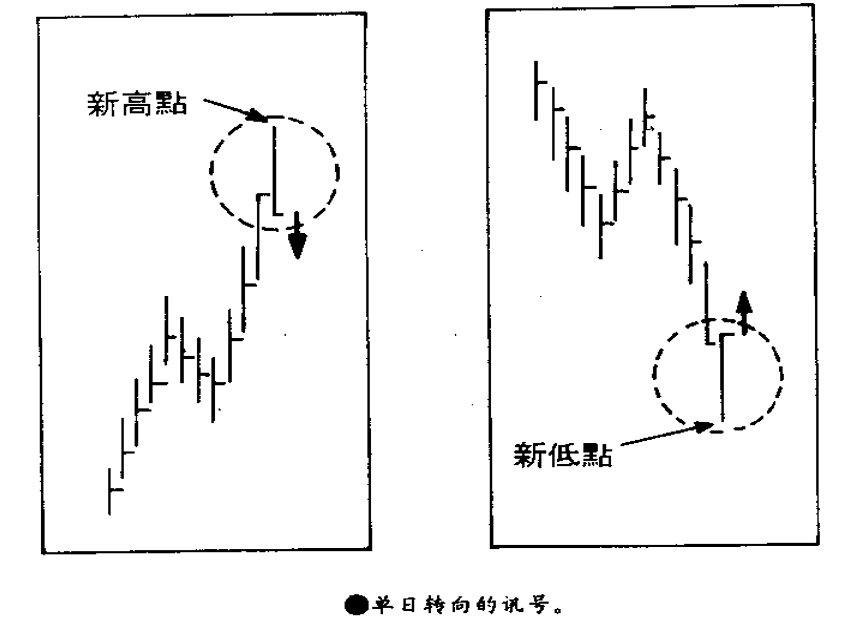
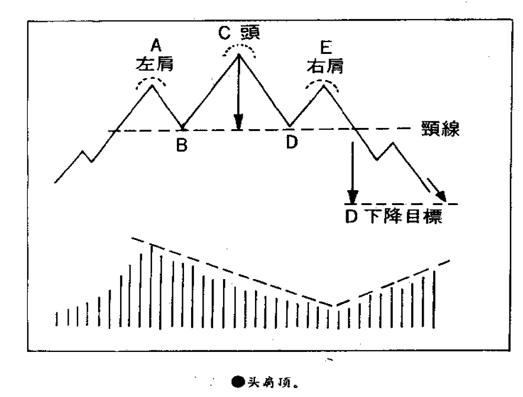
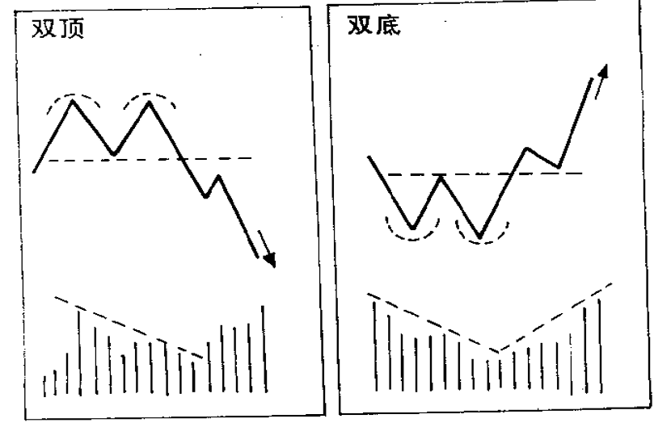
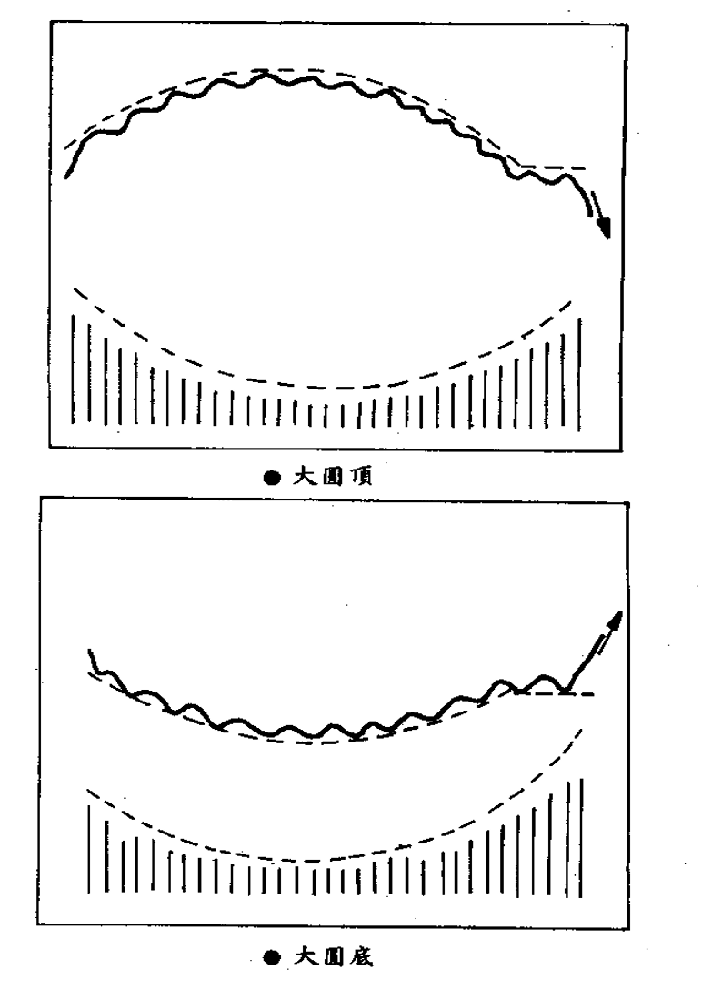
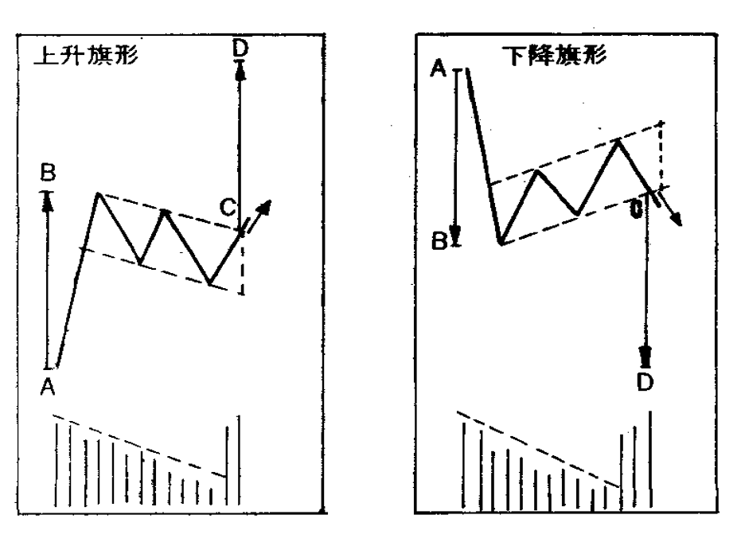
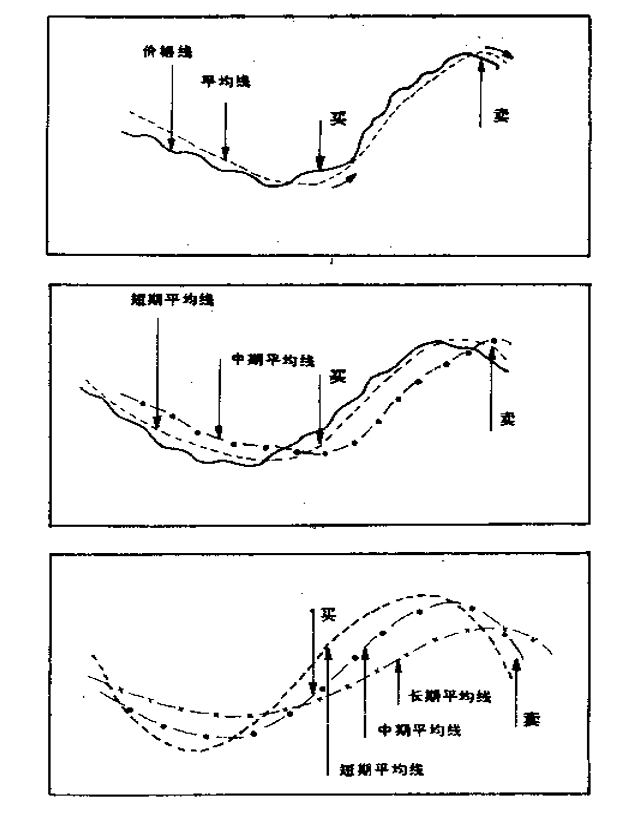

《期货决胜108篇》笔记
============

期货投资是一条“双程路”，你预期某类期货价格会上涨，你可以做“多头”；你判断它会下跌，也可以做“空头”。只要看得准，涨跌都有机会赚钱。说期货交易是项“考眼光，赚差价”的生意亦未尝不可。但就期货交易的社会功能而言，它可供制造商、贸易商、大用家、财经机构及投资者在商品价格波动不定的情况下，使自己的成本不致升高，利润避免缩小。商品的供求规律就是：供不应求价格就涨，供过于求价格就跌。而有效运用期货对冲，则“任凭风浪起，稳坐钓渔船”。

投资期货有以下特点：

*   从投资金额来讲，期货因应投资者的实力和兴趣可多可少。
*   从报酬率（按投资金额来算）而言，期货一般要比股票与房地产更高，“本小利大”的特色更为显著，相对风险也较大。
*   从资金灵活性来说，期货使用保证金制度，只需付出合约总值的百分之十以下的本钱。
*   从投资期限来分析，期货投资期限可长可短：短至数分钟或半年、一年都可以。
*   从买卖手续来看，期货成交手续简便迅捷，可在数分钟内甚至一刹那完成。
*   说到交易灵活性，期货可作多头或空头买卖，是“双程路”。
*   就影响因素而论，期货因为是国际商品，不容易被少数大户人为操纵。
*   若以技术性相比，期货可以运用套利（ARBITRAGE：利用同一期货在不同市场的价格差赚钱）、对冲、跨期买卖等方式降低投资风险。

在一般人的观念中，投资是指周期较长、风险较低、利润稳定的生意；投机是指周期较短、风险较高、可获暴利的活动。期货交易，由于价格波动剧烈，上落快，比对本钱盈利或亏损的幅度较高，参与者百分之九十以上不是作现货交收，而是着眼于赚差价，一些人就认为是投机生意，有种排斥感，甚至裹足不前。不过生意注重的是眼光与判断力，无须为投资、投机的界定自寻烦恼。

任何生意都有风险，如同都有获利机会一样，是一个问题的两面。应该说期货风险的大与小根本全在于自己的控制。而主要的控制手段就是“止损单”（STOP LOSS ORDER）。如果你进场时就定出认赔的幅度，设好止损点，预先下断头单子：做多头的话，跌破支持点就投降；做空头的话，涨破阻力线就出场，这样风险就小了，可以说是“操之在我”。

研究期货经纪人的建议至少应抓住下述重点：

*   研究经纪人所在的期货公司资格是否具备，宗旨是否纯正。弄清楚公司是同客户对赌抑或是纯粹代客买卖，这是服务是否良好的前提。
*   研究经纪人本身是否有责任心和专业水准。经纪人素质对于胜负机率有很大影响。这可以透过经纪人提出的“投资计划书”去分析。一个够格的“参谋”，在列出利多因素一二三四五的时候，必定不会忽略利空因素一二三；不仅要先讲看对怎样追，而且看错怎么救也须有言在先；最理想赚多少要算出来，最严重亏多少也会有笔账；不夸口“包赚”，却强调“交代清楚，尽力而为”。有时，投资人觉察经纪人是新手，就要考虑以下其背后是否有集体力量及集体智慧作“后盾”。
*   研究现在是不是入市的最好时机。一个好的开始就是成功的一半。如果供求、经济、政治与人为等因素比较明朗，图形又出现诸如“头肩顶”、“倒头肩底”、双顶、双底、大圆顶、大圆底等之类的买卖讯号，或者刚好又什么重大的突发性消息入市，就应该好好把握机会，马上行动，不宜前怕虎后怕狼。相反地，不明朗的市不入，无讯号的仗不打。
*   如果前面三点都不成问题的话，剩下来的一点就是研究要投资多少。一个原则是反对赌身家，亏得起多少闲资投资多少。认为这确实是一个机会，估计有百分之四十的回报率，想赚四十万就投资一百万，想赚两百万就投资五百万，自己要心中有数。

市场上买单比卖单多就涨、卖单比买单多就跌。大户只有在顺应潮流的前提下才可以叱咤风云。违背了供求、经济、政治和认为因素形成的大势，再大的市场大户也难免损兵折将。大户的市场活动万变不离其宗，不是向上推就是向下压。对于小户的影响有双重性：你的决策和大户运作方向是一致的，便蒙受其利；你的决策刚好和大户操作方向相反，便要受其害。

“交代清楚、尽力而为”是期货经纪人的职责。那么，身为期货经纪人，应具备些什么特质呢？

*   野心。期货经济业是求知的“学校”，立品的“熔炉”及求财的“战场”，富于挑战性和竞争性。要想淋漓尽致地发挥本身的才干，在短时间内提高自己的经济地位和社会地位，使自己认识这个世界，使这个世界认识自己，期货业提供了这样的途径。艰难的环境和优厚的佣金对立地同意，“种瓜得瓜，种豆得豆”。这个行业是专门给那些“明知山有虎，偏向虎山行”，希望一个月的收入能买一辆小汽车甚至一个住宅单位的人来“拼”的，而不是那些得过且过，满足于一个月一两万入息而不思进取的人来“混”的。
*   毅力。找几个亲戚借三五万元都不是个个愿意，说服人家投资几十万、百万，甚至千万谈何容易！要在这个行业发展，必须多点大海捞针的苦干精神，少点守株待兔的侥幸思想。就算投资建议遭到一百个人的拒绝，也能处之泰然的继续向第一百零一个对象做工作，如果认定是一个有实力、有潜在兴趣的开发对象，要有“三顾茅庐”的诚意，锲而不舍的精神，绝不轻言放弃。
*   勇气。期货投资在某种意义上是看对的人赚看错的人的钱看错额人“进贡”给看对的人。经纪人作为“参谋”向“司令”献计过程中绝不可能次次灵验，有赚有赔是必然的。经纪人要勇于面对失败。当客户户口出现亏损时，重要的是处变不惊的理性对策，而不是如丧考妣的焦灼不安。医生不会因未能令病人起死回生而改行，期货经纪人亦不必因客户亏损而打“退堂鼓”。
*   口才。不同于推销化妆品、家庭电器看得见、摸得着，期货是抽象的东西，是基于预期心理的买卖活动。经纪人推销的是一个意念，一种趋势。如何令客户觉得不是“隔山买牛”，认为走势明朗，信服计划可行，感到“你办事，我放心”，本身的表达能力、说服力很重要。一番谈吐，重点不突出，层次不分明，逻辑混乱，言过其实，令客户接受就难了。要表现出你的“才”，客户才会拿出他的“贝”，合作去求“财”。

经纪人在做法上，应该遵守下述三项原则：

*   要珍惜客户的本钱。做期货可谓“一掷千金”，挥笔下单之时，有无意识到客户本钱来之不易？所以，力求谋而后动，不明朗的市不入，无把握之仗不打，孤注一掷之举不博，看错之势不拖，努力使客户赢多输少。
*   要实事求是。做期货，既有赚大钱的机会，也有蚀大本的风险，如果“包赚”，我们何须做经纪人？干脆自己炒好了！所以，一定要客观分析，对客户讲“利”也讲“害”，不能报喜不报忧。看对怎么赚固然要讲，看错怎么救更要言明在先。不能预测对了就忘乎所以，跌破眼镜又文过饰非。出错主意就要面对现实，吸取教训，同客户研究“从头收拾旧山河”。
*   要摆正“司令”与参谋“的位置，严格按手续办事。除非获得特别授权，否则，每笔买卖都要征得客户同意始能进行。

一份投资计划书应具备如下内容：

*   投资项目。做黄豆就简介黄豆；做原糖就简介原糖。
*   建议投资金额。
*   交易规则。列明合约单位，每口货保证金（注明相当于合约总值百分之几）以及手续费等。
*   走势回顾。将过去一段时期走势作一概括性说明，使顾客对“来龙”有所了解。
*   走势展望。对未来一段时间走势作一客观分析。第一部分讲基本因素，利多因素一二三四要列清楚，利空因素一二三也要讲明白。第二部分写图标讯号，将图表附上，说明讯号指示性。再加上强弱指数、随机指数、价量变化等角度的分析。第三部分是结论，预测大市主要倾向。
*   投资原则。列出不怕错、最怕拖，摘西瓜、不贪芝麻，分兵渐进、不要孤注一掷等指导思想。
*   入市策略。首先是将资金作分段入市的分配方案，列出什么价位准备买入或卖出，即投石问路。第二点是看对的话在什么价位投入第二支、第三支兵，乘胜追击；到什么价位开始套利计算，什么时候全部离场，即鸣金收兵。第三点是看错了出师不利的话，止损单（STOP LOSS ORDER）摆在什么价位（升破阻力线或跌破支持点），即壮士断臂。
*   盈亏比较。列出计算公式，看对赚多少，看错亏多少，加以比较。在何种情况下追加保证金，加多少也要列明白。

人不是神，错误总是难免的。因此从事期货买卖，有一个基本原则，就是有闲钱不妨投资，但要亏得起多少做多少，千万不能赌身家。期货买卖又“发财”的机会，也有“破财”的危险，你要做到任何情况下都不影响自己的生存和发展，前提就是又多余的资金在手才能加以考虑，绝对不能本末倒置，把生存和发展做赌注。

从事期货买卖，除非委托宗旨纯正、经验丰富的经纪人做参谋，一开始就依计划投放大量金额，若要自己一手决策、亲自操作的话，应该遵循“从小开始，逐步升级”的原则。首先，在入市实际买卖之前，最好又两个星期的模拟操作，锻炼一下自己的能力。自己亲自制作图表，或者先让经纪商送来迄今为止的电脑打出的日线图，然后自己每天添上一笔。这段时间，自己判断市况会升或者会跌，就假设已在某个价位新单（NEW OPEN ORDER）买入或卖出，然后密切跟踪市况发展，何时乘胜追击，何时“壮士断臂”，何时见风转舵，看看自己的眼光和灵活性到底有多少分数。从“甜头”中总结经验，从“苦头”中吸取教训。接着，就是入市操作。先进行小额买卖，如公司规定每次起码做五张合约，就由五张做起。当然不能只带“一颗子弹”上阵，最少准备三支“兵”，即是户口要由十五口货的保证金。一开头应该选择一些价格波幅不太大、“杀伤力”较小的商品入手，像S&P500之类“风高浪急”的期货，熟练了以后再做。主要着眼于买卖技巧的实战经验的提高。小额实习大约一个月左右总结一次。要从市况分析和资金运用两方面检讨。特别要注意锻炼自己止损认赔的功夫，树立牢固的“不怕错，最怕拖”的观念。这一点掌握了，你就可以投入“大兵团”，进行大规模作战。

期货买卖，“顺势而行”是原则，“势”未明朗，如何去“顺”？“跟风赚钱”为上策，“风”无定向，如何去“跟”？勉强入市，决策无依据，获利无把握，为“炒”而炒，失去投资意义，且十有八九以亏损收场。不明朗的市不入，无讯号的仗不打。不明朗就是机会未到。这段时间应该休息以下。一来对上一阶段买卖得失先作一番总结，吸取经验教训；二来可以“旁观者清”的立场和“无货一身轻”的姿态，密切注视市场走势，研究下一步卖卖方针。

期货投资赚与亏的机会是一半对一半。亏的时候首先要力求少亏。少亏一点，赚的机会相对就大了，怎样才能做到少亏呢？第一是心理上要有“亏损时买卖结果的一部分”的观念，勇于接受失败，控制好自己的情绪；第二时要强制自己好像机械人一样在第一时间下设限认赔止损单，要有“壮士断臂”的气概，错了不拖。“留得青山在，不怕没柴烧！”

“不怕错，最怕拖”时期货投资最重要的原则。一定要养成习惯，一进场就要下定“止损单”（STOP LOSS ORDER），预防万一。如果自己狠不下心，就指定别人机械式的替自己下这个手。

使用止损限价单时，在何点设限，必须依图表关口、心理关口、本身对亏损程度的容忍及承受能力等三角度去考虑：

*   图表理论概括了多种“形”、多种“线”。成了“形”，破了“线”，就是上升讯号或下跌讯号。你做了多头，就要在图表上量出支持点的价位；将止损卖价摆在稍低于支持点的地方，跌破支持点就认赔；你做了空头，就要在图表上划出阻力点的价位，将止损买价放在稍高于阻力点的位置，冲破阻力点就投降。
*   由于历史上最高最低的纪录，或者时某个大的整数价位，或者可能触及中央银行干预的某个临界点，或者是多数专家、顾问公司注视、渲染的敏感价位等等，都有可能成为投资者的心理关口。
*   最理想的情况下希望赚多少，最严重的情况下容许亏多少，这是一个成功的投资者进场时必须马上考虑的。尤其是“容许亏多少”这一点，也是设限止损的重要依据。
*   正确使用止损限价单，还要注意不能限得太宽或太窄。限得太宽徒然令损失加大，太窄则容易被反复“舔”去。还是依照上述三点原则较为稳妥些。

所谓“大涨小回”，当涨是大势，是长期的时候，跌就是短线，是暂时的。反过来说，“大跌小回”，当跌是大势，是长期的时候，涨就是短线，是暂时的。从幅度上比较，就有“西瓜”与“芝麻”之分。从理论上讲，最好是涨也赚，跌也赚，既摘“西瓜”，又捡“芝麻”。但实际情况往往是贪“芝麻”而亏了“西瓜”。毕竟“芝麻”不知道什么时候才会出现，而出现也是获利有限。既然钱是赚不尽的，作为长线投资，稳健的做法应当是：只摘“西瓜”，不贪“芝麻”。实行摘“西瓜”，不贪“芝麻”，前提是要判断涨和跌哪一头是“西瓜”，哪一头是“芝麻”。这点不能凭个别的、偶发的、表面的利多利空消息下结论，应当了解整个经济、政局背景，掌握供需要素，研究市场心理、图表讯号，根据带根本性、全面性、周期性因素去下结论。还要根据大转折及时调整策略，不要把已蜕变为“芝麻”的方向仍然当做“西瓜”。

在期货买卖中，一些投资者常犯的毛病是：被套牢的时候会横下心来“守”，明明损失“芝麻”的要拖到要亏“西瓜”；有浮动利润的时候反而紧张兮兮地赶着“逃”。有这种心态买卖期货，十个有九个是要失败的。担心市况反复，害怕由赚变亏是对的。但这种担心必须有根据。是有突发性消息令走势逆转呢？是升势接近阻力线了呢？是跌势临近支持区域了呢？是强弱指标（RSI）出现了超买或超卖的讯号呢？还是大多数人一边倒地看好或看淡需要警觉了呢？要有足够理由才好把手头的赚钱货结算离场。只要没有转向讯号出现都要抓住不放，一天都不放过。千万不能见赚就放，应该冷静思考一下“什么时候放更有利”？如同入市的时候要审慎研究一样，结算时也要小心选择价位。亏的时候要设限，赚的时候要赚足，这就是在期货市场制胜的不二法则。

假定一两天内手上的货已获得一倍以上的浮动利润，你就要记住：这个市场不仅是你一个人在做。别的人也在做；别的人会怎样想，会怎样操作呢？比如说是一个突如其来的打升势吧，能够有幸转到一倍以上浮动利润的其他人必有相当部分会获利回吐，作技术性卖出；而在底部做空头被套牢的人，没有实力的早已断头，有实力撑得住的也会有本分人加码空货，调高平均价；而未入市的人眼见已涨了那么多，亦很少会有人再去新单追买。种种力量综合的结果，走势的盘整一般是不可避免的。若有浮动暴利而不立即结算，市况一回档，利润就会“缩水”，甚至化为乌有。

在投资期货过程中，往往资金的运用较测市更为重要。要分兵渐进，不要孤注一掷是一条重要原则。期货的上落永远是波浪式的。且不说有时会冒出一件突发消息使市况逆转，就算“小回”跌一波，暂时性出现浮动损失，到了追加保证金程度，因后援无继，缺乏第二套本钱，你就要被迫断头认赔。等到风浪一过，市况大幅回升，你只有懊悔莫及的份了！

在户口出现浮动利润，走势仍有机会进一步发展时加码，时求取大胜的方法之一。加码的时候应采取金字塔式，即是每次加码的数量都比前一批合约少一半。加码时有三点是必须注意的：

*   赚钱时才加码。
*   不能在同一个价位附近加码。譬如你在四二〇美元一盎司时做了一笔黄金空头合约，应该等市况跌至四一〇美元再空第二笔，跌破四百美元大关再做空第三笔，如果四二〇美元一盎司时卖出第一笔，在市场牛皮之际，四一九·五美元时又卖空第二笔，四二〇·五美元你再空第三笔；几支兵马都散落在四二〇美元的价位左右，这样一来岂不是成了“孤注一掷”了吗？一个反弹上四三〇美元怎么办？
*   不要“倒金字塔”式加码。

要力戒盲目追市。一般来说，个个一窝蜂去抢的时候，你不必急于去追，忍一忍·。大势向好，要作多头就等回顺盘整时才买；大势向下，要做空头时就等反弹高些才卖。除非市况一条直线气冲斗牛或一条直线如石头坠地，你才会错失一次机会，其实，碰上这样特别的市况，就算你下手的行情还有赚的机会，但是价位亦不会好到哪里去。因此，错失也不必嗟叹。

“顺势而行”时期货买卖的重要原则，但最难掌握的是对“势”的判断。一个成功的投资者，对“势”不作主观臆断。一个“秘诀”就是从冲破前市高低点去寻求买卖的启示： 涨破上日、上周、上月最高价就买入；跌破上日、上周、上月最低价就卖出。首先从事实分析，冲破上日、上周、上月最高价，这个“势”相对于上日、上周、上月毫无疑问是个“涨势”。“涨势”买入，理所当然；相反，跌破上日、上周、上月最低价，这个“势”相对于上日、上周、上月十分明显是个“跌势”，“跌势”卖出，顺理成章。其次从“道理”上讲，市场涨跌取决于买卖双方实力对比。当价位冲破上日、上周、上月最高点时，再上日、上周、上月任何价位做空头的人都无一例外被套牢。他们当中一定有部分要认赔做结算买入，反过来又给升势推波助澜；相反，当市况跌破上日、上周、上月最低价时，再上日、上周、上月任何一点做多头的统统都出现浮动损失，当中一定有部分要止损做平仓卖出，正好对跌势落井下石。以上两种情况都是跟市场角力的强者走。但冲破前市的高低点决定买卖也不是次次灵验的。低开高收，高开低收，什么事都会发生。但历史的经验总结下来，十次有六次是这样就值得采用了。

利多消息出来或冲破阻力线后，应涨反跌，是因为利多消息出尽，你不妨跟风做空头；利空消息出现或跌穿支持线之后，应跌反涨，则是由于利空消息出尽，你不妨跟风做多头。总之，有风就快跟，别问这风该来不该来。明乎此，不正常表现就是你赚钱的好机会。

一个成功的期货投资者，在研判行情的时候，必然独立思考，不会依照大多数人的意见随波逐流。经验证明，金融市场（包括证券、黄金、外汇、商品期货在内）是一个大多数人犯错误的市场。期货市场上百分之七十五以上的人都一窝蜂地买入或卖出的时候，你就要注意：“船身开始倾斜”，准备“弃船逃生”；当所有专家、评论几乎一边倒地看好或者看淡之际，你就应警觉：风向酝酿改变，大市随时逆转。一觉醒来，可能满街都是跌碎的眼镜。这是什么道理呢？尽管受供求、经济、政治等因素影响，但直接支配市场涨跌的毕竟是买卖双方的力量对比。何况基本因素永远有两种倾向存在，见仁见智，各取所需而已。当市场上大多数人买入或卖出的时候，有这个能力去承受大量买盘或者卖盘的“少数人”必定是大户。敢和“大多数人”作对手的大户，自然有雄厚的实力和整套的策略，鹿死谁收，不言自明。大众一窝蜂地买入或卖出时，市况会逆转，这是因为：买入之后终究会平仓卖出，卖出之后到头来必须补仓买入，这两种作用力恰恰相反。百分之七十五以上的人买入产生的向上推力是巨大的，到这批人统统结算卖出时产生的向下压力亦是巨大的。加上对手的少数人是大户，大多数人迟早“踢到铁板”，一旦见势不妙，“掉头逃跑”作结算，大户得势不饶人，大势自然就逆转。另一方面，绝大多数人一面倒地买入或卖出造成地过度投机，有时亦会招致政府的干预，使大市风云突变。你在大众心理一边倒之际“众人皆醉我独醒”，反其道而行，当然就会收到“众人皆输我独赢”的效果。

大市的逆转通常呈现出如下讯号：在牛市高潮中以很大的成交量创该声浪的新高价，然后又急促下挫，拉出长黑，以比上日收市价为低的价位收盘；或者在熊市低潮中以巨大的成交量创该跌浪的新低价，随即回头急升，拉出长红，以比上日收市价为高的价位收盘。要及时识别这些转向讯号。

不要天天在市场打滚，适当时间休息一下，以“无货一身轻”的姿态从旁观察市场走势，一来可以使自己脑子绷紧的“弦”松弛一下，重新“充电”，二来可以客观冷静地审时度势、运筹帷幄，以利再战。天天在市场打滚，还可能出现“常炒必输”的情况。期货经济行代客买卖，不可能使义务劳动。为了应付人工、场地、设备、通讯、交易所收费等指出，自然要收取手续费。期货买卖本身盈亏的机会率是一半对一半，这是理论上而言。而在实际运作的过程中，手续费的因素讲获胜机率压低到低于一半。这点不论期货、股票、外汇等金融买卖都是一样，几无例外。所以要选择明朗的机会才好入市，适时又要离场。

平均价战术不可乱用。这种做法属于逆势而行，买入后市况下跌，已证明了原先认为大市会升的判断是错误的。“不怕错，最怕拖”是期货投资的首要原则，此时应该按事前设好的止损点迅速认赔出场。一而再、再而三的逆市投入，只会招致越来越大的损失。平均价战术只适用于小反复，遇到周期性市，这套平均价战术就变成“担沙填海”，等于踏上“不归路”。

当期货市场出现重大的突发性新闻时，行情就会大幅波动。如果原来已持有的合约刚好与消息市走势相反的话，就有必要运用“反转”战术了。反转战术在大市发生转折时效果好，但遇到反复起落市或牛皮市况等等就不能乱用了。看错了及早认赔出场永远是对的。但是否马上采取行动往相反的方向入市，就要综合基本因素、技术分析、数据讯号等，认为仍有足够活动空间时才能实施反转做法。原先认赔损失越小，越值得立刻反转，因为相对剩余空间打；原先认赔损失越大，越不值得立刻反转，因为相对剩余空间小。

执行在市价为A时买入，跌倒B时卖出的两建战术时，户口的亏损已是既成事实，若B点的卖出时结算卖出（SETTLEMENT SELL），就是认赔（CUT LOSS）离场；若作为新单卖出（OPEN SELL），则A点跌至B点的损失会在会计制度上称为浮动损失（FLOATING LOSS），账面上户口仍保持“完整”（没有实际亏损）。两建既然是“锁单”，最大的学问在于“解拆”的时机。最佳的时机就是：即时价位对于一头时有钱赚的；即时走势对于另一头时越来越有利的。例如A点新单买入，跌至B点新单卖出，再往下跌，到了C点市况止跌，开始回升，这是在C点就可拆两建，因为对于在B点的新单卖出来说，结算买入已有利可图；而这时回升之势却令A点的新单买入的亏损越缩越小。相反市况卡在A点与B点之间，或者跌至C点仍未有回升迹象，就不宜乱拆了。

在买卖过程中如何正确应用限价和市价两类单子呢？策略上称重“价”的就用限价。买的时候希望便宜点，就以某个价位或更低一点一些的价位作成交；卖的时候力求卖高一点，就指定到某个价位或更高一点的价位才交易。分析了阻力点或支持点，也可以限定涨破某个价位或更高一些才买进，或跌破某个价位或更低一些才卖出。新单（NEW OPEN）入市原则上多采取限价为宜，错失机会只是零，入价不好被套牢却是负数，少做一单生意，比多做一单亏钱生意要好。如果你的出发点是重“势”，就用市价。一个突发性消息出来，对走势会造成重大影响的，就要以第一时间的市价去追。头肩顶形成且跌破颈线出现大跌讯号，或倒头肩底产生兼升破颈线显示大升走势，都可以用市价进行买卖。判断今日可能拉长红或者长黑，希望走短线即市买卖赚点，也可在开始一刹那市价买入或卖出，在收市一刹那市价结算卖出或买入。假若你已有货在手，就要提高警觉，一嗅出市场气氛不对劲，或有“踢到铁板”的感觉，就要已市价出场，以免限价做不到，赚钱变亏钱或损失加大。

期货有很多种类。有黄金、外汇、大宗物资、贵重金属、指数、利率、期权、债券等等。以大宗物资为例，光是美盘就有原糖、黄豆、玉米、小麦、咖啡、可可、活牛、活猪、猪腩、木材、轻原油等等。有的商品与别的商品有相关联，例如黄豆、玉米、小麦被人称为“三剑客”；有的商品与别的商品毫不相干，例如原糖、咖啡、活牛，便“风马牛不相及”。有时这种商品走势不明朗，另一种商品却很明朗；有时这个市场牛皮沉闷，另一个市场却大起大落。我们必须留意其他商品动向，及时转移阵地。往往有这样的情况：买进（或卖出）某只商品期货被套牢后，市况陷入胶着状态，手上的货成了“鸡肋”，“食之无味，弃之可惜”。这时候，就应该以开阔的视野纵观全局，研究一下其他商品走势如何，捕捉战机，实行“围魏救赵”，争取以“第二战场”的利润来弥补“第一战场”的浮动亏损，原先的货守下去也行，认赔也可以。

在众多期货种类中，有些是属于“同类项”，例如贵重金属的黄金、白金、白银；谷物的黄豆、玉米、小麦；谷物的黄豆、玉米、小麦；肉类的活牛、活猪、猪腩；丝类的生丝、干茧等等。在同样的供求、经济、政治以及认为因素支配下，“同类项”期货的大方向一致。但投资者的精神、时间、金钱、兴趣绝无可能平均地同时介入每只商品，同一时期总是有所侧重。因此，同时一个涨势或跌势，“同类项”的每只商品起步迟早、过程缓急、到“顶”或到“底”先后等一定有所不同。这就有“可乘之机”。“同类项”这种走势“时间差”、“幅度差”，可以说是有把握的仗，胜算很高，不容错过。

一个赚钱的上佳机会，除了基本因素倾向强烈，图表讯号明显之外，还必须具备“输一赢三”、“输一赢十”这样的好赔率。期货走势，再强的牛市总有它的“顶”，再凶的熊市也会有个“底”。从阶段发展来看，更是一个波浪接一个波浪，每个浪都会有它的“波峰”和“波谷”。所谓输少赢多好赔率的机会，就是再临近图表关口、心理关口、干预关口的“顶”时做空头，接近“底”时做多头。假若破“顶”穿“底”只是亏一点点。如果真的成“顶”成“底”那就大赚特赚：

*   从图表关口找机会。例如再一浪高一浪的升势中，把两个以上的小浪之“底”连城一条直线，就是趋势线中的上升支持线，当一个新浪回头，价位靠近支持线时马上入货。同时设限跌破支持线就止损。这样，亏是丢“芝麻”，赚是摘“西瓜”。
*   从心理关口找机会。在市场上，很长时间没有涨到某个整数价位，这个价位就成为上升势的心理关口；相反长期没有跌到某个大数价位，这个价位就成为下跌势的心理大关。接近上升势的心理大关做空头或临近下跌势的心理大关做多头，破关认赔亏损有限，不破的话就有暴利可图。
*   从干预关口找机会。一个国家的政府和中央银行以及交易所为了压抑过分投机，稳定金融秩序，维护正常供求，在某些时候也会采取行动对市场加以干预，令市况急转直下。接近这些关口也可以“以小博大”。

以交收时间顺序来说，同一商品的期货有现货月份、近期月份、远期月份、最远期月份之分。由于季节性或交易旺淡季的影响，有的月份交投比较活跃，有的则显得清单。所谓活跃，就是买卖比较多，成交量大，不论什么时候都容易有买卖对手，可以把手头上的合约顺利出脱。所谓清淡，其特点势买卖比较少，成交量稀疏，有时想卖出没有对手承接，打算买入有没有人出货，价格要么死水一潭，要么大步空跳。农产品类的商品，一般是播种期和收获期的月份最活跃，生长期比较活跃，其余月份则较清淡。采取连续六个月定盘式的日本期货、菲律宾期货，通常是最远期月份最活跃，近期货较不活跃。在买卖时必须善加选择，清淡的月份不要做。一般投资小户若在不活跃的月份交易，必然会成为大户的猎物。

随着时间的推移，无论是连续报价式的活跃月份，还是定盘式的远期月份，都会变成近期月份直至交收月份。通常来说，到了交收月份，由于时日无多，活动空间减少，加上保证金加倍甚至全额交割，对冲避险的生产商实行受现货或交现货的冲击，所以一般投资者都“敬鬼神而远之”，不会把合约拖到交收月份。正是由于这一因素，令交收月份交投疏落，价格飘忽，使投资者更不适宜在此久留。因此，手上的合约及时换月，是减低风险、提高胜算的重要措施。合约换月要留意以下要点：

*   要及早行动，不要拖到“最后一班车”。比如做芝加哥期货交易所的三月黄豆，到了三月一号，就属于交收月份。到二月底最后一个交易日前一两天，会有比较多的结算单。如果前一阶段被套牢的买单比较多，那么结算时卖单较为集中，会令市况更加下沉；如果前一阵子被轧住的空头比较多，到时结算性的买入也未必为大量，会令价位更往上窜。毋须讳言，需要动“换月手术”的，一般是被套牢而又决心守下去的单子。所以，拖到最后关头才出脱换月，只会挤作一团，互相践踏，使价位波动加剧，令损失增大。又经验的做法，是转为交收月份之前一个月就要着手部署，捕捉良机，尽量在还有十天就转月之前结算换月。
*   换月时，结算旧合约和建立新合约要同时以市价进行。不要一先一后，不要用限价。因为合约换月的一个特点时保持同样数量的合约，如果时间上错开处理，先平旧仓再建新仓或先建新仓再平旧仓，要么手上变成“一无所有”，要么“旧爱新欢共处”，都违背换月愿意。用限价有可能旧货结算到，新单做不到；或者反过来救火出脱不了，而新单却成交了，和时间错开一样，都有可能背离换月的出发点。

期货交易的规则时：新单买入或卖出后，最迟到了交收（DELIVERY）月份最后一个交易日，合约就要结算，否则就要履行交现货或收现货的手续。当今国际上各期货市场，绝大多数买家和卖家都是为了赚取差价，真正实行现货交收的可谓凤毛麟角。也就是说，绝大多数买卖合约到头来一定是要在市场结算的。未平仓合约积累得越多，临近交收期得波动也越大。如果前一阵子炒得价位偏高，说明多头者众，临近交付日必定急跌，因为多头合约不结算的话就被迫以偏高的价位收现货。反过来，如果前一阶段压得价位偏低，证明作空头的人多，接近交收日必定急升，因为空头合约不结算的话，就要被迫以偏低的价位交现货。而且，现货月份没有涨跌停板限制，涨跌幅度大。因此，利用长期偏高而临近交收前作空头；利用长期偏低而临近交收前做多头是一个“黄金机会”。不过资金要充裕，因为现货月份要缴全额合约保证金。

有时历史是惊人地相似，如果我们能够记住一些特别的历史事件，且眼前的事态发展“似曾相识”，就能从历史的演变过程中得到启发，对现今事件的结局作出“虽不中亦不远矣”的估计，从而作为期货买卖决策的依据，提高胜算。

某种意义上，期货买卖财富再分配的规律就是：先知先觉的“巧取”后知后觉的，嗅觉灵敏的“豪夺”嗅觉迟钝的。所谓嗅觉灵敏，是指对一些表面看来与期货市场无关的讯息，要善于深入发掘，在一般人不易察觉的环节，找出其中与期货供求关系重大的某种因素，抢先加以利用。人家还没想到的，你已想到，并一马当先，胜利自然在你这一边。

即市走势是千变万化的。仅以日线图来表示，就有十二种形态：

*   升市，有四种，用红线（现在用红色长方形）表示：
    *   开市最低，收市最高，是一根整齐的红线
    *   开市最低，低开高收，但收市并非最高价，是一根有上影线的红线
    *   收市最高，开市价却不是最低。是一根有下影线的红线
    *   全日低开高收，但开市价不是最低，收市价亦并非最高，是一根有上影线和下影线的红线
*   跌市，也有四种，用黑线（现在常用绿色长方形）表示：
    *   开市最高，收市最低，是一根整齐的黑线
    *   开市最高，高开低收，但收市并非最低价，是一根有下影线的黑线
    *   收市最低，开市价却不是最高，是一根有上影线的黑线
    *   全日高开低收，但开市价不是最高，收市亦并非最低，是一根有上影线和下影线的黑线
*   无起跌市，也有四种，开市收市同价用一划（横线）表示，但收高于前市用红线，收低于前市则用黑线表示：
    *   全日只有一个价，一般是全日维持涨停板或跌停板，在图标上只是一划
    *   开市收市同价，但属于全日最低价，中间曾出现过高价，是有上影线的一划
    *   开市收市同价，但属于全日最高价，中间曾出现过低价，是有下影线的一划
    *   开市收市同价，中间曾有高价，也出现过低价，是由上影线和下影线的一划，俗称“十字架”

如果稍微“解剖”一下日线图，即市图形（分时图形）也有即市走势有的各种形态。因此，要做即市买卖的话，一半情况下不宜太早入市。未成形的话，很难把握全日动向。应该先观察一段时间，起码是一个钟头以后，看看有没有“底”可支撑做多头，或者有没有“顶”可参考做空头，同时以哪一点设限止损，这样胜算才提高。

避免赚钱变亏钱主要有两种方法：

*   在势犹未尽时，先将有浮动利润的合约结算百分之五十，只留下一半参与追击。这一减码措施，可保障这笔买卖立于不败之地。因为即使后来形式逆转，留下的一半“打回原形”，先期出场的一半利润已经“入袋平安”。但要注意留下的一半最多设限同价或够手续费出场，可以使零，不能搞成负数。
*   若不分批走货，亦可设限“回档十分之三”就结算，紧跟大势，不断扩大战果，到适当时机市价出场。这个方法的好处在于稳扎稳打，步步为营，保证浮动利润起码有七成进入口袋。

所谓大户，通常是大银行、大金商、大经纪行、大基金会、大贸易商、大财团、大顾问公司等，或是具有这样背景的操作手。大户手法的特点如下：

*   第一是快。大户由于财力雄厚、资讯设备齐全、市场消息灵通、研究人才集中，故能洞悉先机。往往利多利空消息公布之前，大户已预先在市场采取行动。
*   第二是奇。大户做法很多时候是反散户心理之道而行之。所谓“不正常表现”，例如利多消息公开或图表冲破阻力线应涨反跌；利空消息获得证实或图表跌破支持价位应跌反涨等等“没道理”、“图表陷阱”走势，通常都是大户的杰作。而欲扬先抑或欲跌先扬则是惯用伎俩。
*   第三是狠。大户营造出一个走势，经常会计算着一般散户“撑多久才会认赔”，以优势资金挟仓，实行“赶尽杀绝”。散户多数追加一次保证金后很少再加第二、三次，大户就迫使你在“黎明前的黑暗”断头。

所谓大户挟仓，就是大户利用资金优势，看准合约交收期限迫近的时机，拉高或者打压行情，迫使资金单薄的散户在无可选择的情况下认赔补仓（SETTLEMENT BUY)或平仓(SETTLEMENT SELL)的赚钱手法。有些期货买卖规则规定，即市买卖的保证金只相当于过夜买卖的一半。如果太多散户在即市做了空仓或多仓，而又缺乏足够保证金过夜的话，临近全日收市之际，大户又会挟仓，小户一定要在收市前补仓或平仓，争相“逃命”，自相践踏，大户就可以为所欲为。大户挟仓的走势有三个特点：一是背驰。小户依照供求、经济、政治等因素，操正步看涨或看跌的，挟仓方向一定相反，令小户觉得“无理由”。二是速度快。当挟即市买卖的散户仓时，一定时临近收市前半小时甚至十分钟，速战速决。三是幅度大。大户“强力合围”，小户急着出脱，“不计成本”，价位跳动必定惊心动魄。因此，当很多散户有货在手，迟迟未结算，而交收期限已进入“倒数读秒”阶段，但市况依然应跌不跌、应升不升之时，你就要提防“大户挟仓”了！假若能调配好资金，“趁着大户挟仓”的时候马上跟进，反而是一个赚钱的黄金机会。

四类消息影响涨跌：

*   供求：所谓市场“无形之手”，就是供不应求，价格上涨；供过于求，价格下跌。例如矿区罢工、政府拍卖、央行购入、代用品发明等等消息，便对贵金属期货产生影响；又如产区灾害（风灾、水灾、旱灾、地震等）、运输工潮、国家购买、出口政策变化等等信息，就会左右大宗物资投资者的心理。
*   经济：经济繁荣或衰退决定整个社会集团与个人的购买力和投资意愿。各项经济指标的互动关系优势投资者赖以决策的依据。例如利率变动、财政预算、通膨数字、失业率、贸易顺差或赤字、原油价格波动、国际汇率协议等等信息，都会令外汇期货作出敏感反应。
*   政治：政治是经济的集中表现，它的变数对经济产生巨大影响。期货是金融业的重要组成部分，属于最活跃的一环，对政治的反应最为迅速、强烈。例如国际形势紧张、大国政权更迭或首脑安危、战略地区的战争或动乱等信息，都会在黄金、外汇期货市场引起波动。
*   人为：超级大户投机性囤积或抛售、交易所打压投机的临时性措施、政要讲话或央行插手干预、电脑程式指示或故障等等信息，往往亦使期货市场走势发生出人意表的变化。

得到一则新闻或者流言，首先要判断它的真实性（它的来源是否靠谱，内容是否合乎逻辑）；其次是要了解新闻的时效性，通常是路透社、美联社的资讯线路及电讯接收机消息最快，广播、电视次之，报纸又迟些，还要留意大市是否已经提前消化了这个消息；第三点是要分析新闻的重要性，伊朗革命，金价暴升，因地处战略要地，事关石油供应；而非洲小国乍得的内战，对期市来说，似乎是发生在零一个星球一样。一些消息属周期性，具转折意义，影响深远，其长期支配作用。另一些消息则是偶发性、个别性的，影响只属一时；最后，也是最重要的一点就是研究新闻的指示性，确定消息是利多还是利空。以黄金为例，供应减少是利多，需求减少是利空，反应通货膨胀的消息利涨，显示经济衰退的消息利跌，世局动乱的新闻利好，缓和利空等等。与此同时，还要警惕好消息出现却下跌，坏消息出现却上涨的反常现象。

消息引起期货市场波动，波动产生差价。消息入市恰好给我们提供了一个赚取差价的好机会，必须善加利用：

*   在判断消息属利多或利空后，以第一时间顺势而行。是真实的信息，会有一段时间发挥作用；就算是虚假的消息，到澄清亦有一段时间。这段空间，把握得好，已可赚一大截。但要注意若错过了第一时间就不要去追，否则，你入市时人家已获利回吐。
*   “趁好消息出货”或“趁坏消息出尽入货”。原先已有多头合约在市场，一个突发性利多消息出来。就要趁高价平仓结算。因为消息的刺激性会随着时间的流逝而逐渐降低、淡化，应当抓住这个“天赐良机”，及时获利出场；反过来说，本来已有空头合约在市场，突如其来一个利空消息，亦要把握机会，适时在地位补仓，这是大户的惯用手法。
*   抢在重大消息出来之前，买卖两边都下新单（NEW OPEN ORDER），同时两边都设止损盘（STOP LOSS ORDER），争取以最小代价换取最大收益。这是指消息关系重大，而利多利空却难以预料的特殊情况的特殊处理。

如果价格连续多天在一个狭窄的幅度内升降，在图标上形成一幅有如建筑地盘布满地基桩的图景，习惯上称之为密集区，亦即专家所说的技术支持区，这个密集区一旦向上突破或向下突破，就会造成一个烈焰冲天的升势或水银泻地的跌势。参与期货交易，一定要留意这样的机会。在密集区的形成过程中，由于幅度狭窄，不管做多头在还是空头，在密集区都无利可图，失去结算意义。因此，未平仓的合约必定越积越多。大户或是积极收集，或是伺机待发。当密集区终于打破均势，向上冲或向下泻时，有三种力量为这个脱出盘局推波助澜：在密集区部署已久的大户、投资者得势不饶人，猛加“生码”，乘胜追击；在密集区形成期间坚持观望的投资者见走势明朗化，马上跟风，顺市而行；在密集区看错方向的人，一部分会止损认赔，技术性买入或卖出更令突破局面火上加油。不过，因为密集区的酝酿需时，等待突破要有耐性，贸然入市有如赌博，倒不如先坐山观虎斗，以逸待劳，下好限价新单，突破了盘局才顺势去追。

再重大的利空因素，如果不入市行动，市况就不会狂升；再重大的利空消息，假若没转化为卖压，价格便无由暴跌。而买气和卖压的大小，透过每日成交量和价格涨跌幅度得以反映。量价分析，实质是动力与方向分析；成交量是动力，价格走势是方向。价位上升,而成交量大增，表示升势方兴未艾；价位仍升，但成交量渐次缩小者，意味升势已经到了“曲高和寡”的地步，这是大市回头的先兆；反过来，价位下跌，而成交量大增，显示跌势风云初起；价位续跌，但成交量越缩越小，反映跌势已经差不多无人敢跟了，这是大市掉头的讯号。量价分析不能是今日与昨日的简单对比，这样就看不出它的延续性。必须对一周来、一个月来、三个月来的量价互动资料作详尽评估，由量价变动的过去看它的现在，结合它的过去和现在分析它的未来。同时要明白：成交量的增加或减少不会改变价格波动的方向，而仅仅会加剧或缓和价格的上升或下跌。由于每宗交易包括买与卖，成交量就是买契或卖契的数目。成交量大并非指买的人多或卖的人多。升势只是说明买方愿意以高价成交，跌势只是表示卖方愿意以低价成交。动力和方向是两回事，不能混淆。

期货走势，并非时时都是一边倒的大升势或大跌势。介于一段升势与跌势之间，或者两段升势，两段跌势之间，常常会出现一段反复起落的市况。所谓反复起落，是指价位徘徊于一个狭窄区域，接近上限就回跌，碰到下限又反涨，来回穿梭，横向发展。从图形上看，颇像手风琴的琴箱，故此又称“箱型走势”。反复起落产生的原因，是市场上没有明显的利多或利空消息，市况失去单向发展的明朗依据，无论是买家或卖家基本上不作长线投资，只做短线炒作，谁也占不了上风。在反复上落市中买卖的指导战术市走短线，具体对策市：判断了是一个反复上落市之后，接近下限就买入做多头，涨到上限就结算卖出，并反手做空头。再跌至下限，又结算平仓，并反转做多头。反复上落市是一种暂时状态，向上突破或向下突破迟早会出现，所以，走短线也要注意设限止损，最好不要做，等到形式明朗之后才去追。

在技术性资料分析之中，未平仓合约（OPEN INTEREST）的增减是一项重要指标。未平仓合约数量是指未结算的多头合约，或者是未结算的空头合约的数量，并非两者总和。例如，未平仓合约五万二千，即是说市场上同时存在五万二千张多头和五万二千张空头合约未结算。未平仓合约数量是一个累积数，是某个商品的交易月份由开始到现在的未结算合约“存仓数”。未平仓合约增加，意味着新单买入和新单卖出的合约多了，意味着资金流入市场；未平仓合约减少，即是很多合约持有人作结算卖出和结算买入，意味着资金离开市场。在市场交易的形态上，买卖活动分为四种：新单买入、新单卖出、结算买入和结算卖出。未平仓合约的增减取决于这四类买卖的互动关系：

*   新单买入和新单卖出交易时，未平仓合约数量增加；一张新单买入与一张新单卖出成交，未平仓合约便多一笔；
*   新单买入和结算卖出交易时，未平仓合约数量不变。一张新单买入只是代替了一张结算卖出合约原先作为新单买入的位置；
*   结算买入和新单卖出交易时，未平仓合约数量不变，一张新单卖出只是代替了一张结算买入合约原先作为新单卖出的位置；
*   结算买入与结算卖出交易时，未平仓合约数量减少。一张结算买入与一张结算卖出成交，未平仓合约便少一笔；
*   现货交收，未平仓合约减少。一张买入合约收现货，一张卖出合约交现货，未平仓合约便少一笔。

从未平仓合约的增减，我们可以看出资金究竟正在流入市场抑或撤出市场，结合价格波动和成交量变化，有助于了解市场的“来龙”及后市的“去脉”。在一个上升的趋势中，成交量与未平仓合约的增减可以由如下两种不同的启示：

*   价格上涨，成交量与未平仓合约增加。这说明投资者踊跃入市，下一回合的合理发展是：多头乘胜追击，许多空头将被迫结算买入，从量价看后市还会向好。
*   价格续涨，成交量、未平仓合约减少。这显示投资者开始离场。虽然价位是升了，但原先被套牢的空头合约很多已认赔出局，而买入的人也有不少作获利结算，整个上升动力无疑是削弱了。从量价分析看后市有可能逆转。

而在一个下跌势中，成交量、未平仓合约的增减则反映两种不同的含义：

*   价格下跌，成交量、未平仓合约增加。这表示资金大量涌入，买卖角力中，卖家占了上风。新单卖出者把价位压低，而新入场者的买单招架不住，节节退守。从量价分析看后市仍将趋降。
*   价格续跌，成交量、未平仓合约减少。虽然价位仍然在跌，但本来被套牢的多头合约不少已经结算投降，而卖空的人很多已饱食远扬，整个市场卖压显然大为减轻。从量价分析看后市很大可能会止跌反升。

期货市场中，再凌厉的升势也不可能一口气冲上顶，再惨烈的跌势也难一条直线落到底，中间必定要经过“消化”。这个“消化”，术语上称之为技术性调整。技术性调整时由三种力量造成的：一是部分有浮动利润的投资者作获利结算，技术性买盘或买盘使大市受到反方向的压力；二是部分有浮动损失的投资者采取“平均价战术”加“死码”使走势出现曲折；三是有人觉得“这一波已经差不多”，实行短促突击，亦对价位有所冲击。技术性调整给我们提供了一个走短线的机会，通常这样的一次调整，等于前一段升幅或跌幅的百分之三十至百分之五十。它的出现也是有讯号可寻的。例如在上升势中，连续三日拉出红线，但一根比一根端，涨幅逐日递减；或者连涨多日之后，来一个高开低收，拉出一根有上影线的黑线。反过来，在下降势中，连续三日拉出黑线，但一根比一根短，跌幅逐日递减；或者连跌多日之后，来一个低开高收，拉出一根有下影线的红线，这些都是显示跌势将要反弹的预兆。利用技术性调整作买卖只能做短线，一半情况下，调整最多达到百分之五十的幅度时就要当它结束了。因为即使是“平均价战术”的运用者，到了这个价位，大致“和局”，他们都会赶紧结算离场，太贪不走，市况一掉头重回大方向时就变成”贪芝麻而丢西瓜了“。技术性调整不意味着大方向的改变，出现调整时大市的基本因素没有变，市场人气在战略上没有变，图表趋势在整体上没有变，因此调整时暂时的。

涨跌逆转有两类不同性质的演变：

*   一种是大方向的改变，大升势转变为大跌势或者大跌势转变为大升势。这种转向，通常以”双顶“或”双底“、”三次到顶“或”三次到底“、”头肩顶“或”倒头肩底“、”大圆顶“或”大圆底“等形态为标志，属于大动作，一般需要三个星期到一个半月左右的时间去孕育。
*   另一种是技术性调整，即大涨中出现小跌或者大跌中出现小涨。这种转向，通常以一条高开低收，很多时候带有上影线的黑线；或者一条低开高收，很多时带有下影线的红线为标志，属于小动作，在一个交易日内完成，所以称之为”单日转向“。

获利回吐时产生单日转向的主要原因。它的特别之处在于它的开市价和收市价具有承前启后的意义。连涨多日之后再跳空开高或连跌多日后再跳空开低，是单日转向的第一个特点。这一点对于持续多日的急促升势或跌势具有延续性，可以说是”承前“。开高之后拥有浮动利润的卖家，纷纷趁高出货套利，将市价推低，与前一段升势方向相反，形成当日势由升转跌；或者开低之后拥有浮动利润的卖家，纷纷趁低补仓结算，把市价抢高，与前一段跌势方向相反，形成当日是由跌转升。这是单日转向的第二个特点。这一点对于接下来的几天技术性调整的小跌或小涨具有指示性，可以说是”启后“。再一轮急升或者急跌之后，就要留意是否有单日转向的迹象出现。在单日转向的局面将要确定，即临近收市时去做空头或多头，往往可以赚到往后数日的跌幅或升幅。即使是导致走势大方向发生转折的”头肩顶“与”头肩底“之类，追究到”顶“点与”底“点的哪一个交易日，很多都具有单日转向的特征。

作为涨势与跌势的转折点，“头肩顶”是比较可靠的下跌讯号。在金融市场，大户要赚小户的钱，不离“养”、“套”、“杀”三部曲。股票与期货亦莫不如此。“头肩顶”的图形，正是意图做空头的大户鲸吞多头小户的大部署：

*   “头肩顶”是在升势中产生的。当“右肩”未出现时，光看“左肩”和“头”，却是“一浪高一浪”的涨势。即使在“左肩”买入，到“头顶”的价位，仍是“形势大好”、“越来越好”，正好诱使小户继续追买，这就是所谓的“养”；
*   从“头顶”回落，掉头再上，至与“左肩”相近的价位后再急转直下，“右肩”就成形了。这时，在一“头”两“肩”区域买入的合约变得无利可图且出现浮动损失，这无疑是“套”；
*   走势跌破“颈”线时，因为整个“头肩顶”是以“颈”线为“底”的，破了“颈”线，“头肩顶”区域的所有多头合约均被“一网打尽”，无一幸免。空头乘势落井下石，多头纷纷止损认赔，令跌势加剧，这正是“杀”。

一个“头肩顶”的形成，是为一次大跌势打基础，一般需要一个半月左右，将近四十个交易日才可以成型。当“左肩”和“头”出来后，如果我们怀疑可能是一个“头肩顶”，可以去做空头。但要设限止损，升破“头顶”就要投降，因为已证明是一浪高一浪的升势而不是“头肩顶”。当“右肩”成型尚未破“颈线”时，我们亦可估计走势会破线而抢先去卖空，但亦要设限，回头升破“右肩”的顶部就止损离场。因为发展至此，已表明走势并非真正的“头肩顶”，只是一个引人做空头的“假动作”。

一个升浪，由A点出发，涨至B点为顶峰，回头跌至C点，卷土重来又上至B点差不多的价位D点，形成另一个顶峰，跟着就摔下来，跌破A点与C点拉成延长的“颈线”，成为一个跌势的序幕。这种走势形态，因为有两个价位相近的顶，所以一般称之为“双顶”。又因其图形与英文字母M相似，故又叫M顶。相反，在下跌势的末期出现“双底”的，就叫W底。M顶是强烈的下跌讯号，W底是可靠的上升征兆。为什么说“双顶”是“强烈的下跌讯号”呢？因为当第一个“顶”形成而回跌的过程中，肯定是有大旦卖盘进场才使市况下挫，在第一个“顶”的区域的买盘已被套牢。当价位回升至和第一个“顶”差不多的价位时，如果市场买气够旺盛的话，应该就飞越顶峰(OVER THE TOP)，造成“一浪高一浪”的局面。然而，第二波的升势却未能越雷池半步，大有“云横秦岭家何在，雪拥蓝关马不前”之叹，急转直下形成第二个“顶”。很明显，卖家认定这一波升势已是强驽之末，“空军”大举出动，“狂轰滥炸”；而更重要的是，原先在第一个“顶”附近被套车的买家本身心有余悸，觉得第二波反弹只不过是回光返照，一见价位接近“家乡”，便争相出脱，急急如漏网之鱼。因此，“双顶”的形成，反映了普遍不敢看好后市的市场心理，是买家人心虚怯的表现。特别是跌破“颈线”后，整个下降走势便可以确认。双底的情况类似。有时“双顶”雏形刚形成，市况也会有反复，掉头再上，演变成三次叩关，若又不破上两次高价，便蜕变成“三次到顶”，更是空头出击的黄金机会。但无论趁“双顶”做空头或超“双底”做多头，都要下好止损盘，万一风云突变，穿“顶”破“底”就认赔，这叫“小心驶得万年船”。

“三次到顶不破就卖出，三次到底不穿就买入”，不论在期货市场或股票市场，都被视作经典战术之一。所谓三次到顶不破，是两种力量造成的：一是“顶”附近的价值有强大的新单卖盘；二是一到“顶”部就有人作获利回吐结算卖出。三次不破，说明在“顶”部的多空交战中买方“踢到铁板”。其次，若出现三次到顶不破的走势，显然是大户完成”派发”。“派发”就是大户拉高市价引散户追买，从而将自己户头上的多头合约转移到散户手上的一种手法。通常大户都是分批出货的，三次到顶，即是三次拉高派发，每一次到顶部是一种升势假局，“请君入瓮”。三次到顶，大户派发得差不多了，“顶”部已套牢一大批散户买家。不破，就是市势开始回头，在“顶”部入货的人注定要“大出血”。这个时机沽货可谓墙倒众人推，事半功倍。相反地，三次到底不穿，往往是大户欲扬先抑，压市吸纳的手法，所以要跟风买入。由于三次到顶与三次到底的讯号太明显，散户深信不疑，“坚定不移”。特殊倩况下大户亦会故布疑阵，引人上钓，待散户狂沾之后回头直上，或趁小户买齐之后急转直下。所以三次到顶不破做空头或三次到底不穿做多头之际，都要在第一时间设限价单止损，万—破顶穿底就认赔，这样便高枕无忧了。

大圆顶和大圆底属于渐变的和慢性的大市转向讯号。圆顶的形态是：在一轮大升势之后，市况进入胶着状态，每日波幅很少，先逐日向上蠕动，再逐日向下蠕动，在图表上多天的日线图恰好构成一抛物线，然后开始一段跌势。相反，圆底的形态是：在一轮大跌势之后，走势陷入牛皮局面，每日上落不大，先逐日向下蠕动，再逐日向上蠕动，在图表上多天的日线图正巧形成一个“炒菜锅”的形状，接着出现一段升势。在各种转势的图形中，大圆顶和大圆底是酝酿时间最长的形态，一般耗时两三个月之久．是个特慢动作。原因是这样的：第一、在酝酿期间，支配性的供求：经济、政治、人为因素并没有明显的重大变化，更缺乏突发消息入市。“物极必反”、“否极泰来”的周期性预期心理占了主导作用。可以说是“和平演变”。第二、在圆顶和圆底形成过程中，每日成交量及末平仓合约显著减少，即市买卖亦意兴阑珊，所以转市的节奏、步伐便相对显得缓慢。第三、大户在圆顶酝酿时的出货和在团底购过程中的吸纳，带有“小量、多批、持续”的特点，造成由量变到质变时表现出“循序渐进”、“潜移默化”的轨迹。虽然圆顶和圆底的形成旷日持久，但在技术分析层面看来却比较可靠，不容易是个“假动作”。从投资策略来说，当我们怀疑是一个圆顶形成的时候，可在价位超过抛物线顶点，开始“走下坡”之际下单抛空。但必须设限止损，万一超越抛物线最高点就认赔；反过来，当我们认定了一个圆底形成的时候，可在价值超过弧线底点、开始“爬坡”之时下单买入。但要设限止损，万一跌穿圆底的最低价就投降。总之，图是死的，人是活的。有了预防万一的应变措施，“假动作”也不容易令我们上当了。

任何一种走势，都有它酝酿、产生、发展的过程。记录在图表上，就呈现一定的形状。某种图形一旦成型，通常对后市发展都有相当启示作用。虽然不是绝对，但因其机会率较高，有其参考价值。上升旗形与下降旗形属于技术上比较可靠的图形之一。所谓上升旗形，是这样一种形状：一轮节节高升，在坐标中好像一支旗杆；接着四五天的日线图波幅大致一样，惟每日最高价、最低价均比上日低一些，将连日最高点拉成一条直线，将连日最低点拉成另一条直线，刚好是平行斜向右下方的旗帜形状。相反，下降旗形则是这样一种形状：一轮节节下挫，在图形中，如一支旗杆；接着四五天的日线图波幅大致一样，惟每日高峰、低点均比上日高一些，将连日最高点拉成一条直线，将连日最低点拉成另一条宣线，刚好是平行斜向右上方的旗帜形状。旗形是大升势或大跌势所作的技术性调整的产物。所以旗的方向与大势方向相反。在调整完毕后，以上升旗形为出发点、会再有第二波升势；以下降旗形为基地，会再有第二波跌势。第二波升势或跌势，大致上相等于原先第一波“旗杆”的幅度。上升旗形的突破讯号是：涨破连日最高价拉成的旗形上道，第二波升势开始；下降旗形的突破讯号是：跌破连日最低价拉成的旗形下边，第二波跌势又来。一般来讲，突破都在旗形由开始计起的第五天之后某一日出现，投资策赂是等突破之后立即双进。旗形在两种情况下会变质：第一、若调整幅度超过了原先“旗杆”的百分之五十那就不是技术性调整，而是转势了；第二、若在旗形区来回徘徊太久，比如拖了几个月，“旗帜”变成了“绸带”，技术上便不可靠了。

趋势线是被投资者广泛使用的一种图表分析工具。虽然简单，但有其实用价值。趋势线的概念是：在一个上升走势中，把两个或两个以上升浪的“底”连成一线，加以延长，这就是上升趋势线；在一个下降走势中，把两个或两个以上的下跌浪的“顶”连成一线，加以延长，这就是下降趋势线。趋势线的理论是：若大势轨迹仍在上升趋势线之上运行，多头合约仍然可以持有；若跌破上升趋势线，就视为转势，要改为作空头。反过来，若大势轨迹仍在下跌趋势线之下游离，空头和约依旧可以保留；若升越下降趋势线，即是买入讯号，要改为作多头。期货市场的价格趋势，由买卖双方力量较量所决定。图表，其实是一份“战况”记录。买家力量占上风，图表就是一浪高一浪；卖家占了压倒优势，图表就画出一浪低一浪。上升趋势线以上的“走廊”，恰洽是“一浪高一浪”的惯性运动方向；下降趋势线以下的“通道”，正好是“一浪低一浪”的惯性运动路径。假若走势跌破了上升趋势线，说明买气已由盛转衰，“一浪高一浪”的惯性已遭扭转，所以成为出货讯号；相反，如果走势冲破了下降趋势线，证明卖压已由强变弱，“一浪低一浪”的轨迹发生逆转，因此成为入货讯号。但是，依据趋势线的讯号买或卖实在太简单。因为把两三个浪“底”或“顶”拉出一条上升趋势线或下降趋势线，是很浅显、很容易的事，“种瓜得瓜、种豆得豆”，太容易的东西不会有太高的回报率。而且参考趋势线买卖的多数是初入行者，故此，市场大户最喜欢把趋势线的迷信者当猎物，有意破一破线，设个图表陷阱让你踩下，然后又回头，把你杀个莫名其妙，“死”了也不知是怎么回事。所以，就算图表冲破了下降趋势线或跌破了上升趋势线，你也要综合当时的供求、经济、政治等因素，看看基本分析是否真的利多或利空，这洋，才不容易被“假动作”骗倒。如果基本因素和其他技术指标(例如强弱指数、量价分析、波段理论等）都和趋势线吻合，就不妨“强棒出击”。这时可不要自己吓自己；因为前面不是“陷阱”，而是“油田”!

有些技术分析家比较偏好移动平均线（MOVING AVERAGES)来做买卖依据。移动平均线种类繁多，以计算方式而言，则有三大类：

*   简单移动平均线(SIMPLE M.A.)。即若干天的收市价加起来再除以天数，在图表上一天一个点连结而成。例如五日平均线就是包括今日收价在内，上溯至五天收市价除以五。
*   线性加权移动平均线(LINEARLY WEIGHTED M.A.)。即若干天的收市价及依倒数顺序递减一的不同比例，来加权计算的移动平均线。例如十日线性加权移动平均线，就是将今日收市价乘以十，昨日收市价乘以九，前日收市价乘以八……倒数第一O日收市价乘以一，总数加起来除以五十五。
*   线性非加权移动平均线(NON—LINEARLY WEIGHTED M.A.)。原理和线性加权移动平均线一样，都是越近编制日期的收市价占的加权越大，距编制日期越远的收市价所占的加权越少，不过递减并非是一。而是取一个适当的权数。这类平均线的加权法较为复杂。

很多技术分析家认为，不能将以往若干天的收市价对后市的启示作用等量齐观，应该是越新的收市价对后市的启示作用越大，越旧的收市价对后市的启示作用越少。故此，在前进的第一种简单移动平均线的基础上发展出后两种平均线的编制方法。在使用效果上后两种平均线优点大于前者，因为简单移动平均线不能迅速反映市场价格的急据波动，信号较慢。但各种平均线对大趋势则提供了较为准确的讯息。利用移动平均线买卖方法很多，共同特点是着重于基本走势，而不理会价格的一时波动。缺点是应变能力不行，可谓“急惊风遇到慢郎中”。宜扬长避短，方能提高胜算。利用移动平均线买卖的方法大致上有：

*   收市价高于平均线时买入；收市价低于平均线时卖出；
*   当市价由下而上，涨越平均线时买入；当市价由上而下，跌破平均线时卖出；
*   利用两条时间长短不同的移动平均线买卖。当短期移动平均线由下而上，涨过长期移动平均线时买入；若短期移动平均线由上而下，跌穿长期移动平均线时卖出；
*   当收市价高于短期、长期两条移动平均线时买入，当价位低于其中一条平均线时马上平仓离场，当收市价低于短期、长期两条移动平均线时卖出，当价值高于其中一条平均线时立刻补仓结算。

图表是死的，人是活的。没有任何一种理论是绝对正确的。如果出现了绝对正确的理论，市场就会马上失去它的机能和生命力。生气勃勃的市场活动，恰恰是在各种分析工具时而正确，时而错误的环境中得以不断地延续。人本身受时间、空间的局限，人们创立的各种流派的测市理论当然也会受时间、空间的局限。即使我们对某种测市理论的研究累积了一定心得，有所收获，也要清醒地认识到，我们对走势的驾驭只是部分正确、一时正确；假若以为自己从此全部正确、永远正确，甚至夸言“包赚”，那么，肯定要受到市场“无形之手”的惩罚，“一次意外，足以毙命”！总之，对各种测市理论，可以参考，不能迷信。不能死抱教条，按图索骥。更不宜自命得道，走火入魔。对专家、权威的意见应该重视，但却不能盲从。要想想“万一错了怎么办”，并拟好预防措施。

  
  

### 部分专业术语说明

相对强弱指标（RSI）： RSI=100×RS/(1+RS) 或者,RSI=100－100÷(1+RS)， 其中RS=X天的平均上涨点数/X天的平均下跌点数（用幅度代替点数也可以），X常取14。举例说明： 如果最近14天涨跌情形是：第一天升2元，第二天跌2元，第三至第五天各升3元；第六天跌4元 第七天升2元，第八天跌5元；第九天跌6元，第十至十二天各升1元；第十三至十四天各跌3元。那么，计算RSI的步骤如下：

*   将14天上升的数目相加，除以14,上例中总共上升16元除以14得1.143（精确到小数点后三位)；
*   将14天下跌的数目相加，除以14,上例中总共下跌23元除以14得1.643（精确到小数点后三位）；
*   求出相对强度RS,即RS=1.143/1.643=0.696（精确到小数点后三位）；
*   1+RS=1+0.696=1.696；
*   RS/(1+RS)=0.696/(1+0.696)=0.41038;
*   RSI=100\*0.41028=41.038 即14天的强弱指标RS1为41.038。不同日期的14天RSI值当然是不同的，连接不同的点，即成RSI的轨迹。 在股票市场，RSI大于70%视为超买讯号；RSI小于30%视为超卖讯号。在期货市场，RSI大于80%视为超买讯号；RSI小于20%视为超卖讯号。
*   例子及定义来自[百度百科](https://baike.baidu.com/item/RSI/6130115)

阻力线：一段时期里期货每日最高价的上确界，以一条横线表示。这个价位反复出现但从来没有涨破过。

支持线：一段时期里期货每日最低价的下确界，以一条横线表示。这个价位反复出现但从来没有跌破过。

平均价战术（AVERAGE，日本术语为“摊平”）：当市价于A点时，根据所搜集的资料判断行情会上升而买入，但可能基于某些因素而暂时下跌。故当市价下跌至B点时，更应买入（因原有资料显示行情会上升）。这样，总体买入的价位就是A点yuB点之间的平均价，比A点为低，一旦行情涨回A点，便可反败为胜。依照这个策略，若市况从B点继续下跌，则在C点再买，再跌又再D点再买……总之平均价越拉越低，只要市价升至平均价以上则可获厚利矣。跌市做法亦同此理。

“反转”（SWITCH）战术：在A点做了多头之后，新的刺激因素使市况下挫，对行情重新检讨，确认原先的判断是错了，则立即在B点双倍卖出，变多头为空头，当价位下跌至C点时，除弥补原先的亏损外尚可获利。反转其实包含了两个层面：一是原先的合约作认赔处理，符合“不怕错，最怕拖”的原则；二是调转枪头，争取反败为胜，符合”顺市而行“的原则。

两建（HEDGING）战术：当市价在A点时新单买入（OPEN BUY），而当价位下跌至B点时作新单卖出（OPEN SELL），将浮动亏损“锁”起来（所以两建又称锁单），固定在一个数字，当市价跌至C点时，将在B点的空头予以结算买入，待市价回升超越A点时，再将A点早期的多头平仓卖出。这样就可以两头获利。

限价单（LIMIT ORDER）：一定要到某个价位或者比这点更好的价位才买进或卖出的期货市场买卖单。限价单买卖的价位比较理想，但不一定能成交。止损单就是限价单的一种。

市价单（MARKET ORDER）：就已市场即时价位成交的期货市场买卖单。市价单保证能成交，但做出来的价位不一定理想。市价单还可以细分为：MOO（MARKET ON OPENING），即开市一刹那市价买或卖；MOC(MARKET ON CLOSE)，即收市一刹那市价买或卖；MIT（MARKET IF TOUCH），一旦接触到某个价位就以市价买或卖等。

换月：把手中临近交收月的原有合约结算，同时在买卖最活跃的月份（在定盘式买卖的市场中则是远期月份）建立新的合约。一般情况下换月都是保持同样数量合约，保持同样买卖方向。

即市买卖（DAY TRADE）：新单买入或卖出和结算卖出或买入都在一个交易日内完成的一张期货合约。其他的期货合约交易称为过夜买卖（OVERNIGHT TRADE）。即市买卖的合约保证金只需相当于过夜买卖的一半。

波段理论（ELLIOTT WAVE PRINCIPLE）：ELLIOTT认为股票走势是周期性的，一个周期的表现如下图： （图片来源：[知乎专栏](https://zhuanlan.zhihu.com/p/69537078)）

