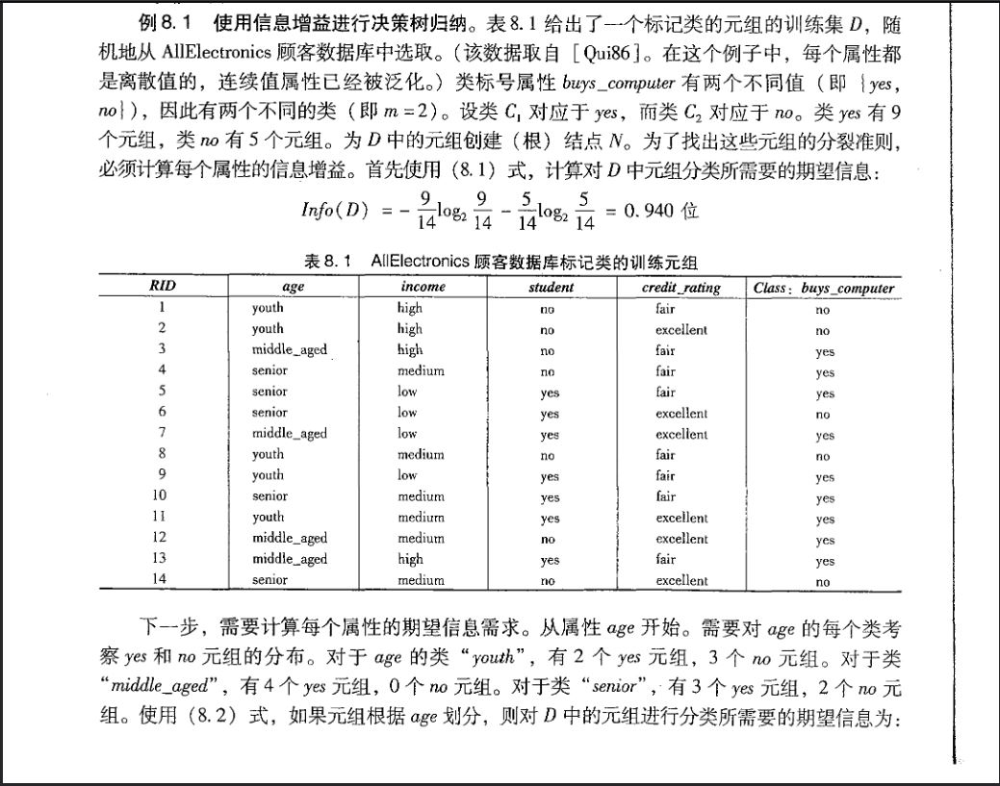
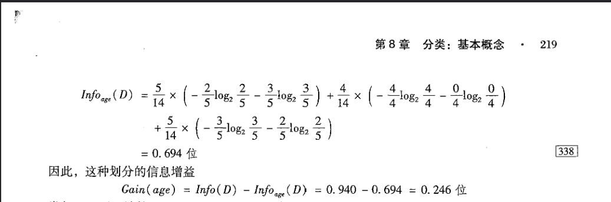

《集体智慧编程》中文版笔记
=============

### 第2章 提供推荐

本章的主要内容是讲如何为用户提供推荐。假设你拥有一个像豆瓣一样的点评类网站数据库，上面记录着不同的用户对不同的内容的评分，从中选出某一个用户和他的记录，如何给这位用户推荐他可能喜欢的内容呢？我们可以先从我们的生活经验出发去尝试解决这个问题。在生活中，我们有什么场景是想要寻求推荐的呢？买电脑、买书、看电影、吃饭等等。在这些场景中，我们会问什么人去获得推荐呢？第一类人是专家，在买电脑时我们可能会看各种博主测评，或者直接问自己认为比较懂电脑的亲朋好友同事。第二类人是用过这些产品的普通用户。

当我们只考虑专家推荐时，我们会习惯于选择自己相信的专家然后听取他们的意见。在我们的问题中，假设我们能够知道数据库中哪些用户是专家用户，要想用这些专家数据提供推荐，我们还需要找出某一个用户最相信哪一位或者哪几位专家的意见。因为一个用户在听取了专家意见购买产品或者服务后，不一定会在网上反馈他的体验。另一方面，一个用户购买了某款产品的决定并不一定是听取了专家的意见。不过我们现在需要强行缩小考虑范围，方便我们探讨如何根据专家意见做推荐，因此我们需要先下一个强假设：用户的购买决定都是基于专家意见，建立出一个初步模型后再逐渐通过修改这个假设条件来优化我们的模型。在一开始，他可能并不相信任何一位专家，他只是随便看了看几个专家的测评就做决定了，如果说他不喜欢他买到的东西，那么他对产品的评分将会比较低，也不会再相信这位专家了。如果他喜欢买到的产品，他对产品的评分会比较高，他也会继续关注这位专家的测评。将这种情况放到我们的数据集里，我们就会发现我们和我们不喜欢的专家在同一样产品的评分上会有明显差异，而我们和我们喜欢的专家在同一样产品的评分上会比较接近。再抽象一点，我们可以用两点间距离来衡量我们对这些专家的信任程度：设某一普通用户和某一专家用户都评价了N个产品，普通用户对这些产品的评分为(x1, x2, ..., xN)，专家用户对应的评分为(y1, y2, ..., yN)。我们可以计算(x1, x2, ..., xN)和(y1, y2, ..., yN)的距离d=sqrt((x1 - y1)\*\*2 + (x2 - y2)\*\*2 + ... + (xN - yN)\*\*2)。

求出了距离之后，我们发现距离有大有小，距离越小代表信任程度越高。那我们能不能根据距离构造一个信任程度变量来直接衡量信任程度呢？我们可以令信任程度s=1/(1+d)，这样就得到了一个取值在(0,1\]的信任程度变量，s越大信任程度越高。

得到了信任程度后，我们可以挑选出最信任的（亦即s最大的）前k个专家，对该用户没有购买而这k个专家都购买了的每个产品，计算这个产品的推荐得分p=p1 \* s1 + p2 \* s2 + ... + pk \* sk，其中p1, p2, ..., pk表示这些专家对这个产品的评分，s1, s2, ..., sk表示用户对这些专家的信任程度。将这个产品列表按p从高到低排序，就能得出我们给用户提供的推荐产品列表啦。

如果我们只考虑普通用户的推荐时，我们同样可以采用像我们考虑专家推荐时的方法来给出一个推荐产品列表。因此，我们可以将所有人都视为专家，然后按照前文所述的方法给出一个推荐列表。这样的话，我们在只考虑专家意见时下的强假设，就可以减弱为：用户的购买决定都是基于其他用户的意见。这种方法有一个名字叫做协作型过滤。对于前文中提到的信任程度的计算，我们也可以考虑使用相关系数来代替，或者使用其他计算两点间距离的方式来进行模型性能提升。

实际上信任程度的概念可以也引申出用户相似度的概念。用户相似度表示两个用户之间品味的相似程度。信任程度越高，购买方式越接近，相似度就越高。我们既然可以计算两个用户之间品味的相似程度，是否页可以计算两个产品之间的相似程度呢？设某一产品甲和另外一个产品乙都有相同的N个人进行了评价（也就是说这N个用户都评价了这两款产品），这N个用户给甲产品的评分为（x1, x2, ..., xN)，对乙产品的评分为(y1, y2, ..., yN)，我们可以计算这两组评分的距离d=sqrt((x1 - y1)\*\*2 + (x2 - y2)\*\*2 + ... + (xN - yN)\*\*2)。距离越近，代表两个产品的相似程度越高。和前面一样，我们可以引入产品相似度的概念s=1/(1+d)。s越大两个产品相似程度越高。给定某一产品，我们就可以根据s选出k个与该产品最相似的其他产品用作推荐。我们可以用这种方式寻找相似的音乐，同类的书籍和电影等。我们也可以基于物品的相似程度以及用户的评分记录来给用户提供推荐。某个产品的推荐得分p=p1 \* s1 + p2 \* s2 + ... + pM \* sM，其中M为我们评价的产品个数。对于某个产品以及某个用户，我们可以参考它和这个这个用户以往评价过的每个产品的相似度，通过计算加权平均的方式估算出一个可能的评分，将这些产品按照估算出的评分从高到低排列就可一得出我们给用户提供的推荐产品列表。

在实际应用中，随着用户数量的增加，计算信任程度或用户相似度的开销将会越来越大，而且需要实时更新，这是因为我们总是要及时找到某个用户信任的用户是哪些人，而且我们需要在不同的用户上线的时候就要知道来给他们提供推荐，用户的评价记录更新较快，时常会出现新的信任程度高的用户，因此更新的频率较高。相对而言，产品相似度的结果会随着用户的增多而变得越来越稳定，因此我们只需要每隔一段长时间更新一次就可以得到一个较为准确且稳定的相似程度列表。这两种推荐方法在不同类型的产品中的效果会不一样，我们可以做一个AB测试来判断哪一个方式来判断哪一种方法更受用户喜欢。

还有一种基于用户记录的推荐方法，是利用条件概率公式计算出在购买某一样产品甲后，会接着购买下一样产品乙的概率。这样在已知用户购买了产品甲后，可以给用户推荐用户大概率会接着购买的几个产品。我们也可以将这种高频率出现的购买组合打包成一个套餐，通过一个优惠的价格吸引更多的用户来购买这些产品。

<br>

### 第3章 发现群组

本章学习如何构建聚类。构建聚类是一种无监督学习，所谓无监督学习，就是在不带有标准答案的数据中寻找特征的技术。本书中列举了下面几个例子来展示不同的构建聚类以及将聚类可视化的方法。

第一个例子是构建博客聚类。我们通过简单的浏览，甚至仅仅阅读标题就可以了解一篇博客的主题，这是因为博客的正文或标题中出现了一些我们能够轻易进行分类的关键词。如果我们能够提取出一篇博客的关键词，我们就可以根据关键词的内容对博客进行分类。所以我们要解决的问题是如何提取出博客中的关键词。这个问题要分两步来完成，第一步是提取出博客中的所有词语，第二步是在这些词语中找出可能的关键词。

如果这篇博客是英语博客，或者其他单词间有分隔的语言的博客，提取词语就非常容易，我们只需要将每个单词提取出来就可以了。但如果这篇博客的语言并没有这种将单词分隔的特性（比如中文、日语）的话，我们就需要借助一些可以完成分词工作的函数库来提取出句子中的所有有意义的词汇。提取出所有的词汇后，我们可以构建一个词汇集合，以便进一步提取出关键词。在这个集合中，我们应该容易发现集合中存在非常多的很普通的形容词、冠词、代词、或者日常用语，看到这些词语的时候，我们根本没有办法判断文章的内容，因此我们需要删去这些词语。要在词汇集合中剔除这些词语，我们可以先构建一个常用词语集合，然后求出我们的词汇集合和常用词语集合的差集即可。另一个方法是我们直接统计词汇集合中，每一个词语在博客中的出现次数。我们知道，许多高频率出现的词汇都是常用词语，因此我们直接根据每个词语出现的次数，删去出现最多的前A%，剩下的词语我们就可以将他们加入可能的关键词集合中。

对于每一篇博客，我们都可以按照上述的方法构建出一个可能的关键词集合。对每一个这样的关键词集合中的每一个元素，我们可以统计它在博客中出现的次数，然后将出现次数最少的前B%的词语从关键词集合中剔除。这样做是因为博客中可能会出现一些非常生僻的词语，这些词语非常少见，但我们构建聚类时需要考虑这些生僻词语出现次数，于是这些词语也可以像其他出现次数比他们更多的词语一样影响最后聚类的结果，让最后的结果并不能真的很好地将博客分类，所以我们需要将这些词语聪关键词集合中剔除。

因此，现在我们对收集到的每一篇博客，都可以按照前述的操作得到一个关键词集合，也能够知道关键词集合中每一个词语在该博客中的出现次数。现在我们需要利用这些信息对博客进行聚类。首先我们对这些关键词集合求并集，这样就得到了一个“关键词语表”。利用这个词语表，我们就可以用同一个维度的坐标系表示每一篇博客中的关键词们的出现次数。如果词语表中的某个词并未出现在一篇博客中，该维度的数值为0，若该词语出现在了博客中，则该维度的数值为出现的次数。这样，对每一篇博客i，我们都能得到一个坐标(x\_i1, x\_i2, ..., x\_iN)，其中N表示关键词语表中词语的总数。对于这些坐标，我们就可以像第2章一样，计算任意两个坐标之间的距离。但是和第2章的情况不同，这里我们应该使用（1-相关系数）而不是欧几里得距离来计算距离。这是因为某些博客的长度很长，导致同样的关键词语的出现次数比较多，如果用欧几里得距离来比较的话，与同样主题但是篇幅更短的文章的相似度也可能会比较低，而相关系数则没有这个问题。这些坐标之间的相似度要保存下来，因为在构建聚类的过程中将会被反复用到。

有了相似度后，有两种方式构建聚类：分级聚类和K均值聚类。分级聚类的原理如下：

1.  找出相似度最大的两个坐标，然后将他们合并，合并后的坐标变为两个坐标的中点
2.  计算新的坐标与其他坐标的相似度
3.  重复第1步只到只有1个坐标

分级聚类的原理非常像Kruskal算法，我们也可以用树状图的形式将分级聚类的结果呈现出来。

K均值聚类的原理如下：

1.  随机生成K个中心点
2.  计算每个坐标到K个中心点的距离，若某个坐标i距离中心点j的距离最近，则赋予坐标i一个标记j
3.  对于每个标记j，计算被标记为j的所有坐标的重心。这个重心成为新的中心点j
4.  重复第2步直到没有中心点发生改变为止

K均值聚类的结果可以通过一个叫多维缩放的方式，在平面上呈现出来，方法如下：

1.  使用博客两两间的相似度作为它们之间的目标距离，初始化总误差率为正无穷大
2.  对于每一篇博客，在平面上随机生成一个坐标
3.  对于这些坐标，求出两两间当前的欧几里得距离
4.  将当前距离与目标距离进行比较，求出误差=当前距离 - 目标距离， 将求得的每个误差的绝对值相加，得到新的总误差
5.  新的总误差小于旧的总误差，进行步骤6和7直到总误差几乎不变为止，否则结束程序
6.  根据每个求出的误差，按比例移动坐标。比如，点A(x\_A, y\_A)到点B(x\_B, y\_B)的当前距离d具有误差e，我们就可以按照如下方法移动点A： x\_A = x\_A + r \* (x\_B - x\_A) \* e / d; y\_A = y\_A + r \* (y\_B - y\_A) \* e / d，其中r大于0表示前进幅度。前进幅度的大小决定循环的次数和效果，前进幅度太小效果好但是循环次数很多，前进幅度太大效果差但循环次数少，r一般取0.01但可以根据实际情况再进行调整。移动公式的推导可以用相似三角形来理解。
7.  对于新的坐标，重新计算两两间当前的欧几里得距离，跳转到步骤4

类似于第2章，我们除了可以构造聚类来找出相似的博客以外，还可以通过聚类找出相似的关键词。对于每一个关键词，我们都可以得到一个坐标（x\_i1, x\_i2, ..., x\_iM）表示这个词在每一篇博客中出现的次数，M表示博客的篇数。对于这些坐标，我们可以和前文一样计算任意两个坐标的相似程度s，并使用分级聚类或K均值聚类来构造聚类。

如果出现的次数只会是0或者1（也就是没有出现或者有出现）的话，我们也可以使用雅卡尔距离=1-对应坐标同为1或同为0的维度数目/(M+M-对应坐标同为1或同为0的维度数目)来作为距离的计算公式。这个情况常见于偏好数据（比如用户喜欢什么讨厌什么，用户已经拥有什么想要拥有什么）中。

<br>

### 第四章 搜索与排名

本章介绍如何构建一个搜索引擎。在构建搜索引擎之前，首先要收集素材。我们需要写一段代码，像爬虫一样从一组网页开始进行宽度优先搜索，直至某一给定深度。这个程序会将网页的正文内容提取出来并储存，对于正文中的链接，程序会将其添加至宽度优先搜索的队列末端。

现在，许多网站都拥有了动态加载的功能，但使用BeautifulSoup只能爬道网站的静态信息，我们需要使用自动化工具（例如Selenium）来帮助我们抓取网站上的动态内容。

获取了网页的正文后，我们需要为网页的正文内容建立索引以便能快速地检索出相关信息。本书使用由以下几个数据库表建立的模式来建立索引：


在收集素材的过程中，我们已储存了网页的正文内容。对这些网页，我们首先查看urllist，看看我们是否已经处理过这个网页了。如果市，那么我们可以跳过这个网页，否则，我们要将网页中的词语提取出来。提取词语的方式可以参考第3章。在这里，我们还可能需要某种词干提取算法，将单词的后缀去掉后保存词干信息到数据库。这样做可以令搜索引擎提供更多可能由帮助的搜索结果。对提取出的每个词语，我们将它的信息添加至linkwords、woedlist和wordlocation这些表中。

在实际应用中，我们也可以用lucene库来建立索引。

建立起索引后，我们就可以写代码处理查询。单个词的查询使用wordlocation表即可。若是多个词的查询（即输入是一个短语或句子），则需要先提取出输入中的每个单词，再根据单词的数目自连接wordlocation表进行查询。例如：

```
select w0.urlid,
       w0.location,
       w1.location
  from wordlocation w0,
       wordlocation w1
 where w0.urlid = w1.urlid
   and w0.wordid = 1
   and w1.wordid = 2
```

就可以完成一个涉及两个单词的查询。在返回的结果中，若这两个词在同一个网页中出现多次，则根据单词位置的不同组合，同一个网页会返回多次。

获得结果后，我们还需要对结果进行排序，将与查询真正匹配的页面排在前面。排序的方式有下面几种：

1. 基于关键词频率的排序。得分 = (单词在文章中的出现次数) / (单词在所有文章中的出现次数)。例如“Functional programming”的得分 = “Functional”的得分 + “programming”的得分
2. 基于文档位置的排序。得分 = 1 - ((单词在文章中首次出现的位置) / (单词在所有文章中首次出现的位置之和))。这个想法是基于越靠近文章开头甚至标题的词语更有可能成为文章主题，若待查询的词语出现在这里，则匹配的可能性更大。
3. 基于单词距离的排序。如果带查询的关键词数目多于两个，关键词语间的间隔越小时搜索到的结果可能更匹配。

方法3关于得分的表述有些复杂，我们尝试用两个例子来展示如何计算得分。

如果查询的内容是"programming"，一篇文章中它出现的位置为10，20和25，那么它的原始得分为programming这个词在文章中相邻的出现位置的距离的最小值，也就是5。如果在另一篇文章中它只出现了一次，那么它的原始得分为正无穷(用一个相对较大的常数代替)。

如果查询的内容是"functional programming approach"，它们在某篇文章中出现的位置为(functional, 2)， (programming, 30)，(approach, 18)，(programming, 20)，那么它的原始得分为functional和programming所有出现位置的距离的绝对值的最小值加上programming和approach所有出现位置的距离的绝对值的最小值。在这个例子中这个原始得分=18+2=20。

这个方法其实并没有限制单词出现的相对顺序，所以在有些文章中如果出现了类似"functional approach of programming"的内容，它的原始得分就是5。

计算完原始得分后，最终的得分定义如下：
得分=1-(文章原始得分)/(所有文章原始得分之和)

以上提到的排名方法都是基于内容排名的，基于内容的排名有一个问题，如果有些网站没有什么实际内容，但是充满了各种常见的搜索关键词的话，在按照内容排名的搜索引擎里面可能会排名靠前。于是有人想到了用外部链接的方法来对排名进行修正。我们可以将外部链接理解成引用，某个网站的内容被引用得越多，说明这个网站的内容比较靠谱，它的排名就越靠前。另一方面，如果能被排名靠前的网站引用，同样也可以说明这个网站的内容靠谱，它的排名也应该更靠前。

PageRank算法就是基于上述两点构建的算法。这个方法理论上是在描述某个人在某个已知页面开始，点击任意次链接后，到达某个未知页面的概率。如果某个网页拥有来自其他热门网页的外部链接越多，到达该网页的可能性越大。如果用户不停地点击，那么用户是可以最终到达每一个页面的，但实际情况是用户可能进行几次点击之后就不会再继续了。因此这个算法还加入了一个值为0.85的阻尼因子，表示用户从一个网页跳到另一个网页的概率为0.85。还有0.15的概率是这个用户在总共N个网站里挑中某一页面开始浏览。于是在下图所示的例子中，已知网站总数为10，b、c、d会被跳转到的概率为pr(b)，pr(c)，pr(d)，我们就可以更新pr(a):

pr(a) = 0.15 / 10 + 0.85 * (0.5/4 + 0.7/3 + 0.2/1)

经过多次迭代后，每个网站的pr值会收敛，我们就可以停止计算并使用收敛后的结果。在计算前需要随机赋予每一个网站一个不为零的初始pr值，这是因为如果所有网站的pr值为零的话，一次迭代将不会改变网站的pr值。

在初始化的过程中，如果我们人工地赋予每个网站不同的初始pr值的话，我们将得到一个个人化的搜索结果排名。

计算出每个网站的pr值之后，我们怎样利用它来优化我们的搜索结果呢？针对我们要搜索的内容，我们可以在索引中查询哪些网页具有我们要查询的词那么我们就可以将这些网站拎出来用pr值进行排序，又或者计算这些网站的pr值的百分位数后，与上述的基于内容的评价标准进行加权得出一个综合得分。

得到网页的得分排序后我们可以按照排序的顺序给用户输出网页，但是用户并不一定认为第一个页面拥有他想要的信息。如果我们知道用户最终点击了哪个页面，那么我们可以基于这个结果来对我们搜索的结果进行优化。进行优化的方法是使用神经网络。

一个神经网络的示例如下图(图片来自《数据挖掘·概念与技术》中文第3版第263页)。由图可以知道神经网络由三个部分组成，输入层，隐藏层以及输出层。隐藏层与输入层是全连接的。这样的神经网络称为多层感知器。它的训练方式成为后向传播法，具体原理如下：

1. 初始化各种权重为1，这样所有的输入层和隐藏层变量均会保留原值输入下一层。
2. 前向传播。对于隐藏层和输出层的每个变量，输入值为与该变量直接连接的上一层变量的值*它的权重，输出值均为tanh(输入值)。这个tanh函数称为激活函数，可以根据不同应用更换为relu或者sigmoid函数。
3. 后向传播。一个后向传播的示例如下图(图片来自《数据挖掘·概念与技术》中文第3版第263页)。其中theta4, theta5和theta6为偏移值用于修正误差。前向传播时会直接加到下一层的结点的输入值中。
4. 重复2和3直到权重收敛。


我们可以将训练好的神经网络，针对不同的搜索输入对每个网站进行评分，并将得分与现有的网站得分进行加权，最后给出一个新的排序。

<br>

### 第五章 优化

本章主要讨论优化问题的各种解法。所谓优化问题，就是在一堆可能的解决方案中，找到最优解的问题。对于这类问题，一般采取如下流程：

1. 表示一个题解。
2. 定义一个成本函数。这个成本函数的最小值就是我们优化的目标。
3. 运用优化算法，尽可能找到全局最优解。

下面介绍几种寻找最优解的方法：

1. 随机搜索法。随机生成N个解，输出这N个解中的最优解。一般作为比较优化算法的基线模型。
2. 爬山法。随机生成一个解，找出这个解和这个解的所有相邻的解中的最优解。然后对这个最优解，我们再比较它的相邻的解，并找出它们中的最优解，重复这个过程直到最优解不改变。这个方法比随机搜索的方法更快，但很容易找到局部最优解。其中一个解决方法是重复爬山法数次然后选出这几次结果中的最优解。
3. 模拟退火算法。设置一个初始温度T以及温度的降低速度cool，然后随机生成一个解，计算它的成本函数值。然后在合理的取值范围内，改变解的其中一个变量的值，再计算这个新的解的成本函数值，如果这个函数值更小，那么接受这个解，然后更新温度。否则以概率e\*\*(-两个解成本函数值之差的绝对值/T)接受这个解，然后更新温度。温度的更新方法为T = T \* cool。这个方法的优势在于能够在一定条件下接受一个没那么好的解。这样就有可能得到全局最优解。
4. 遗传算法。这个算法首先随机生成一组解，将这组解成为种群，我们计算这个中每个解的成本函数，按低到高挑选出前k%的解，这些解为精英解。对精英解中的每一个解，按照一定的概率p0进行变异(类似于模拟退火)或交叉操作(生成一个0到1的随机数，如果随机数值小于p0则进行变异操作，否则进行交叉操作)。变异操作的过程为：给定一个变异的概率p1，随机选择一个变异的位置和一个0到1的随机数，如果随机数值小于p1，则进行变异，否则不变异。交叉操作是交换解的部分，它的过程为，给定一个交叉的概率，随机选出两个解，随机生成一个变异位置以及一个0到1的随机值，如果随机数值小于p2，则进行交叉，否则不交叉。对新生成的种群，计算成本函数并再选出前k%的解，重复这个过程N次(相当于繁殖N代)，输出最终种群中成本函数最小的解。

上述的优化算法，在全局最优解的位置接近局部最优解的情况下会比较有用，如果最优解的分布处于无序状态，选择随机搜索可能效果会更好。

<br>

### 第六章 文档过滤

本章主要讨论文档过滤的方法。文档过滤其实就是在对文档进行分类的过程。这种分类过程是一种有监督学习，也就是说我们需要提供分类的正确答案，才能让计算机自己“学习”如何能够得到这个正确答案。另外一种方式是我们提供我们自己定好的过滤规则，让计算机执行这些规则对文档进行过滤。常见的文档过滤应用有分辨垃圾邮件，分辨重要邮件，给文章分类别等等，我们首先来讨论如何分辨垃圾邮件。

要判断一封邮件是否为垃圾邮件，首先我们需要对邮件的内容进行处理，常见的处理方法是分词并对每个出现的词语进行计数。简单的分词的方法可以参考第一章。

完成分词这项工作之后，我们其实已经可以进行判断了。这是因为垃圾邮件总是有一些规律，比如主题中出现一些垃圾邮件中常见的关键词，或者是全文大写等等，我们可以自己制定相应的规则来对文件进行过滤，大多数邮箱也都提供这些功能。这种按照规则过滤的方式存在的问题就是我们需要制定适合自己的规则，而不能完全照搬别人的设置来用。如果使用机器学习的方法的话我们就可以让机器自己生成一套这样的规则来完成垃圾邮件过滤的工作。

那我们应该让计算机怎样去判断一封邮件是否为垃圾邮件呢？我们可以通过计算条件概率的方式来进行判断。假设事件(w1, w2, ..., wN)表示一封邮件中出现了w1, w2, ..., wN这些词语，事件(SPAM)表示一封邮件是垃圾邮件。如果P(SPAM|w1, w2, ..., wN) > P(~SPAM|w1, w2, ..., wN)，那么这就说明一封出现w1, w2, ..., wN这些词语的邮件是一封垃圾邮件。

那么我们如何计算这个P(SPAM|w1, w2, ..., wN)呢？根据贝叶斯公式，我们有P(SPAM|w1, w2, ..., wN)=P(SPAM, w1, w2, ..., wN)/P(w1, w2, ..., wN)=P(w1, w2, ..., wN|SPAM)\*P(SPAM)/P(w1, w2, ..., wN)。在这里，我们需要预先人工地为大量随机的邮件进行分类，以这些邮件中垃圾邮件的比例作为P(SPAM)的值。而由于我们还需要计算P(~SPAM|w1, w2, ..., wN)=P(w1, w2, ..., wN|~SPAM)\*P(~SPAM)/P(w1, w2, ..., wN)，它与P(SPAM|w1, w2, ..., wN)的计算公式是共分母的。我们实际上只需要计算P(w1, w2, ..., wN|SPAM)\*P(SPAM)和P(w1, w2, ..., wN|~SPAM)\*P(~SPAM)并对他们的结果进行比较即可。这个方法由于用到了贝叶斯公式，所以也被称为贝叶斯方法。

理论情况下，贝叶斯方法能够给出最准确的分类结果。但是，在实际情况中，贝叶斯方法却并不常用，这是因为贝叶斯方法中P(SPAM|w1, w2, ..., wN)和P(w1, w2, ..., wN)要求在一封邮件中出现w1, w2, ..., wN这些词语，但在实际情况中，当我们碰上这样一封邮件的时候，我们的数据库里可能并不存在这样的邮件。这个时候就没有办法进行分类了。而另一方面，当N的数量很大时花在数据库检索和计算的时间也会变得非常庞大。因此，为了继续作用这个方法进行分类，我们需要添加以下假设：

P(w1, w2, ..., wN|SPAM) = P(w1|SPAM) \* P(w2|SPAM) \* ... \* P(wN|SPAM)

其中，P(w1|SPAM)=P(w1, SPAM)/P(SPAM)=P(SPAM|w1)\*P(w1)/P(SPAM)。而P(SPAM|w1)=出现词语w1的垃圾邮件数/出现词语w1的邮件数，P(w1)=出现词语w1的邮件数/总邮件数，因此P(w1, SPAM)=P(SPAM|w1)\*P(w1)=出现词语w1的垃圾邮件数/总邮件数。我们可以按照类似方法求出P(w2, SPAM), ..., P(wN, SPAM)然后求出P(w1|SPAM), ... , P(wN|SPAM)然后利用前文所述的假设求出P(w1, w2, ..., wN|SPAM)\*P(SPAM)和P(w1, w2, ..., wN|~SPAM)\*P(~SPAM)。

在这个方法中，P(wK)=0的情况虽然存在的数量会比较少，但是依然会存在。对于这个情况，我们可以用一个叫做拉普拉斯平滑的方法。平滑后的P(wK)=(x+出现词语wK的邮件数)/(总邮件数+分类数目)，其中x属于自定义值，取值范围为1~分类数目，分类数目指的是过滤的类别数目。以分类垃圾邮件为例，分类数目为2（垃圾邮件与普通邮件）。

朴素贝叶斯方法还有一个问题，那就是当样本标签不是均匀分布（比如垃圾邮件明显少于正常邮件）的时候给出的结果并不是很准确，因此我们还需要手动设置一个新的阈值，比如P(w1, w2, ..., wN|SPAM)*P(SPAM) > 3*P(w1, w2, ..., wN|~SPAM)\*P(~SPAM)时才认为一封邮件是垃圾邮件。

另一个处理不均匀样本的方法是使用费舍尔方法代替朴素贝叶斯方法。因为P(SPAM|wK)在样本分布不均匀是给出的结果会明显偏向数量较多的标签，导致P(wK|SPAM)携带了这个明显的偏差所以费舍尔方法选用归一化的方法来表示概率P(wK|SPAM)，记新的概率值为P'(wK|SPAM)=P(wK|SPAM)/(P(wK|SPAM) + P(wK|~SPAM))，我们于是可以得到P'(w1|SPAM), P'(w2|SPAM), ..., P'(wN|SPAM)，令S=-2\*ln(P'(w1|SPAM)\*P'(w2|SPAM)\*...\*P'(wN|SPAM))，费舍尔方法告诉我们，如果不同的P'值是相互独立而且是随机的话，那么不同的S值将服从自由度为2\*N的卡方分布，如果我们将S值代入自由度为2\*N的倒置卡方分布，我们可以得到这个倒置卡方分布的观测值小于S的概率。这个概率的另一个含义是这封邮件属于某个标签的概率。有了这个概率，我们可以设定一个更精确的阈值来对垃圾邮件进行过滤。

<br>

### 第七章 决策树建模

本章我们学习一种新的分类器：决策树。决策树最大的特点是分类的过程易于解释，也容易可视化。

我们可以手动的基于我们的现有的数据人为地构造决策树，有一个叫做PDC的软件能够提供交互式构造决策树的功能。

而要构建一个分类准确的决策树，我们需要找到能够很好地区分不同类别的特征。那怎样找出这些特征呢？我们可以通过下面几个方式：计算基尼不纯度、计算信息增益、计算增益率、计算方差。我们用«数据挖掘：概念与技术»中的内容作为示例：

对于信息增益的定义和计算请参考下面的截图（图片来自《数据挖掘·概念与技术》中文第3版第218、219页）




对于增益率的定义和计算请参考下面的截图（图片来自《数据挖掘·概念与技术》中文第3版第220页）


基尼不纯度的定义和计算请参考下面的截图（图片来自《数据挖掘·概念与技术》中文第3版第221页）


如果说我们的分类结果不是一个具体的分类，而是一个数值结果（比如价格），那么我们会面临两个问题。第一个问题是分类的类别非常多，这是因为我们认为每一个价格都是一个分类。另一个问题是计算机并不能识别价格的高低和接近程度，因此我们需要引入方差的计算来教计算机将数值接近（即方差小）的分类结果分到一起。在进行分割点计算的时候，在某个分割点上，加入分开的两个集合中分类结果的方差均小于某个给定的数值，那么我们就保留这个分割，否则我们就舍弃这个分割。

决策树模型有一个问题，就是过分拟合。这是因为我们在构建决策树的时候会不断分割直到分割出来的每一个集合里面都只有一类结果不能再分割了为止。这样的话我们构建的决策树可能会在已有数据的分类上表现良好，但对不符合已有数据规律的新数据就无法进行准确分类。而且我们的决策树也会因为分割次数太多导致非常复杂，分类的时间也会变长。因此我们需要通过一个叫做剪枝的方式来开来降低决策树的复杂度，提高处理新数据分类时的准确率。剪枝的方式有两种，第一种是在构建决策树的过程中进行剪枝，如果我们的新分割标准能够提供的信息增益/不纯度/方差与上一个分割点的数值相比差别小于一个给定的值的话我们就停止分割。这种方式的问题在于有可能一个分支的创建结果与之前差别不大，但是对分出来的分支进行分割时的差别却很明显。因此另一个方法是先将整棵决策树构建出来，然后合并分割结果与上一个分割结果差别不大的叶子节点。

决策树的优势除了分类过程易于解释外，还可以为我们理解数据提供帮助，某些对分类结果没有帮助的数据我们就可以不用继续收集了。

另一个优势就是决策树可以同时接受分类数据和数值数据进行输入。这是因为分割特征是使用的计算过程是能够根据不同类型的数据来对应进行处理的，但其他模型就不一定了，比如优化算法、聚类、相似度计算的输入就需要是数值型的数据。但决策树的处理能力仅限于划分一个特征的不同取值范围，如果分类结果取决于不同特征之间的组合（比如两个特征间的差值）的话，决策树分类的准确度将会明显下降。我们需要提前挖掘出这些特征来喂给决策树才行。

决策树的另一个优势是处理缺失数据的能力，我们可以赋予每个分支的最终结果值不同的权重，当出现待分割的数据数值缺失时，可以计算每个分支的最终结果并计算他们的权重，以他们的加权平均作为最后的分类结果。

综上，决策树适合用于数据特征有明显分界的，有大量分类和数值数据的数据集。又或者是需要理解计算机决策过程的情况。 

<br>

### 第八章 构建价格模型

假设你拥有一个葡萄酒的数据库，数据库里的每一瓶葡萄酒拥有一组特征以及价格。现在给定一瓶新的葡萄酒以及它的各种特征数值，一个估计它的价格的方法是在数据库中找到与它最相似的K瓶葡萄酒，并计算这K瓶葡萄酒的价格的平均值。这个方法被称作K-最近邻算法。如何相似程度可以参考第一章的内容。K-最近邻算法也可以用来进行分类。

K-最近邻算法的效果主要取决于三个因素，第一个因素是K的大小，我们不能让K太小，这样可以避免被极少数极端的情况影响了我们的结果；我们也不能让K太大，这样可以避免被大量没有关联的情况影响我们的结果。第二个因素是每一个近邻的权重，我们总是希望最近邻的权重大一些，稍微远一些的邻居权重小一些。最后一个因素是相似度的计算。在第一章中计算相似度的时候，我们会认为每一样特征都有一样的权重。但在实际情况中，不同的特征的重要程度往往是不一样的，我们需要有一个方法来调整这些特征的权重。

因素一的解决方案就是枚举法。因素二的解决方案就是使用一个函数来给基于距离给出一个权重值。函数的选择有以下几种：
1.反比例函数：f(x)=1/(x+c)其中c是常数，用于放大距离接近的两个样本的权重差异。反比例函数由于在距离较小的时候变化较大，因此对噪声很敏感。
2.减法函数：f(x)=c>x?(c-x):0。减法函数对于距离很大的近邻显得无能为力。
3.高斯函数：f(x)=exp(-x/(2\*sigma\*\*2))。sigma是正态分布的方差。

对于因素三，我们可以使用第五章中的优化算法来找到最优的权重分配。在目标函数的设定上，我们需要用到一种叫做交叉验证的技术。它将样本数据随机分成N等份，使用(N-1)份进行训练，用1份进行测试。在这里我们可以用一次交叉验证的所有预测值与实际值的距离的平方之和作为目标函数的值，使用优化算法对每个特征的权重进行分配。我们注意到特征值的取值范围可能会不一样，有些特征的取值范围会明显比别的特征要大，我们需要对这些特征进行缩放，使得他们的取值范围一致，这样的模型的结果会更好。缩放的方法可以是等比例缩放，或者是计算Z-score将他们缩放到0～1的范围内。

上述这个价格模型中，还有一个问题没有被考虑到，那就是折扣问题。同样的产品，在有折扣和没有折扣的时候的价格是不一样的。 这导致最后我们期望的结果其实不是一个确切的价格，而是一个价格范围。我们需要找到概率最高的价格范围。

给定一个价格范围，我们可以用这样的方法求出一个测试样本的预测价格位于该价格范围内的概率。首先我们找出这个测试样本的K-最近邻，并计算出他们各自的权重，然后计算落在给定价格范围的近邻的权重与所有近邻权重之和的商。这个商就是我们要求的概率值。

有了这个概率计算方法，我们可以绘制出概率分布函数，来看这个概率的分布情况。有了这个分布情况，我们可以尝试构造一个概率分布拟合这个分布情况。从而得出概率密度函数，这样就可以知道出现某个价格的概率值。 

<br>

### 第九章 高阶分类：核方法与支持向量机

本章讨论一种新的分类器：支持向量机。再介绍它之前，我们先来了解一下一个概念：线性分类器。它的原理是：计算出每个分类的数据点的几何中心后，给定一个未知分类的数据点，与它距离最近的那个几何中心所属的分类就是这个数据点的分类。决策树就是一个线性分类器的例子，下图就是一棵决策树作用在以下散点图上的结果。我们从这张图上就可以了解到决策树模型的优势与劣势：优势是分类准确率高，劣势是模型复杂且容易出现过拟合。


判断数据点与各分类的几何中心的距离可以用欧几里德距离来判断，也可以用向量的内积来判断。设两个分类的几何中心分别为M1和M2，它们的中点为V，待分类的数据点为X。如果向量XC和向量M1M2的内积大于0，则说明X距离M1更近，如果内积小于0，则说明X距离M2更近。如果分类有很多个，则我们需要分类的几何中心两两配对来通过向量内积进行比较。

本章对于特征处理还提供了一些方法。对于分类特征，除了可以使用独热向量编码以外，还可以针对近似的特征进行特殊的编码，比如可以将是否喜欢滑雪和是否喜欢滑冰进行合并，喜欢滑雪和滑冰记为1，只喜欢滑冰或只喜欢滑冰记为0.5，不喜欢滑雪和滑冰的时候就记为0。另外，对于不同的长度/距离数值，我们需要对他们缩放到同样的距离范围才能够进行比较。一种缩放的方法是使用距离的最小值和最大值，最小值记为0，最大值记为1，其他的数值就可以得到缩放值：(数值-最小值)/(最大值-最小值)。

但即使有了上述这些处理方法，对于类似下图所示的数据时，线性分类器依然无计可施。这是因为两个分类的几何中心是同一个点。对于这种类型的数据，我们需要对坐标进行变换，使得这些数据再次变得线性可分才行（如下图）。这个变换方法称为核方法。


核方法的种类很多，但由于我们之前提到的线性分类器，在计算距离时采用的方法是点积，这里有一种叫做核枝法的方法，用一个非线性的坐标变换代替点积。这样我们就可以继续基于线性分类器的原理进行非线性的分类了。不过，在新的方法下，我们没有办法知道坐标变换后的几何中心坐标值，于是原来的比较方法不再适用。于是我们换一种方法来判断距离，那就是用未分类的数据点与坐标原点组成的向量与一个分类下每一个点与坐标原点组成的向量求点积，然后对这些点积求均值。要对这两个平均值做比较，我们还需要计算一个偏移量，这个偏移量的计算方式是分类中的每一个点对同类的其他点作点积然后求均值，然后让这两个均值作差。这个偏移量加上此前计算的两个均值的差就能得到一个点积的均值，这个均值如果小于0就说明X和M1更近；均值大于0则说明X和M2更近。这个方法能成立是因为先求点积再求均值和先求均值再求点积是等价的。

有了这个核枝法，我们就可以对原来线性不可分的数据集进行坐标变换，直到我们找到一个最大间隔超平面将两类数据区分开。最大间隔的意思是指这个超平面要离两个分类都尽可能远，这是为了避免过拟合。

我们发现，最大间隔超平面实际上是由数据集中处于每一个分类边缘的点来确定，这些点与坐标原点组成的向量我们称他们为支持向量。寻找支持向量并利用核枝法确定最大分隔超平面的方法就被称作支持向量机。支持向量机既可以用于线性的分类，也可以用于非线性分类。

<br>

### 第十章 寻找独立特征

本章介绍一个新的特征降维的方法：非负矩阵因式分解。它的原理如下：

假设矩阵M表示我们的数据集，每一行代表一个样例，每一列代表这个样例的各种属性的值。假设M是一个x\*y的矩阵，我们可以令M=A\*B，其中A的大小为x\*n，B的大小为n\*y。如果n小于y，那么我们就完成了特征降维。非负矩阵因式分解方法的目标就是要找到满足前述情况的矩阵A和B使得((A\*B)-M)\*\*2尽量接近于0。这个方法要求A,B,M均为非负矩阵，在实际情况中我们可以用缩放的方法将带有负数值的属性缩放到一个正数区间内，以便使用非负矩阵因式分解进行特征降维。

问题来了，我们进行完特征降维之后，我们应该怎样解读这个特征降维的结果呢？A矩阵的每一行表示每一个样例，每一列表示新的属性值。B矩阵的每一行表示新的属性值，每一列表示原有的属性值在每一个新特征中的权重。矩阵A就是特征降维之后的输出，可以用于分类器训练。我们可以利用矩阵B来分析矩阵A的结果。比如说，对于矩阵A中第一列的数值比较大的几行，我们就可以看看矩阵B看看原来属性中哪几个属性对这个新属性的贡献最大。在书中作者举了一个区分新闻文章内容例子，矩阵M的行表示文章，矩阵M的列表示某个单词在文章中出现的次数。我们对这个矩阵M进行非负矩阵因式分解后，我们可以将得到的矩阵A的列理解为文章种类，然后在矩阵B中寻找对每一个文章种类贡献最大的单词。

接下来我们来看如何进行非负矩阵因式分解。本质上，它是一个优化问题，目标函数为((A\*B)-M)\*\*2。我们可以用第五章中的优化方法来进行优化。但是由于A,B矩阵可能会比较大，用优化方法找出好答案的时间比较长。这里有一个更高效的方法:使用乘法更新法则进行迭代。迭代的方法如下:

1. 首先，随机生成A和B，计算目标函数值。如果目标函数值等于0，则退出迭代。如果不等于0，进行以下计算直到目标函数值等于0或达到最大迭代次数：

2. 计算矩阵transpose(B)\*M
3. 计算矩阵transpose(B)\*B\*A
4. 计算新一个矩阵A，计算过程是先将矩阵A，矩阵transpose(B)\*M，transpose(B)\*B\*A变成数组，然后对矩阵A中的每一个值与transpose(B)\*M的每一个值对应相乘，再对应除以transpose(B)\*B\*A的每一个值。
5. 计算矩阵M\*transpose(A)
6. 计算矩阵M\*A\*transpose(A)
7. 计算新一个矩阵B，计算过程是先将矩阵B，M\*transpose(A)，M\*A\*transpose(A)变成数组，然后将矩阵B中的每一个值与M\*transpose(A)的每一个值对应相乘，再对应除以M\*A\*transpose(A)中的每一个值。
8. 计算新的目标函数值。 

<br>

### 第十一章 遗传编程

本章介绍遗传编程。遗传编程和遗传算法在概念上有点类似，但它的执行对象不是一个解答，而是一个程序。我们首先生成许多随机的程序，然后根据自己定义的规则衡量每个程序的表现，然后对程序的表现进行排序，如果存在程序达到我们对表现的要求，则我们停止算法，否则，我们选择表现最好的几个程序，然后对他们进行变异或者交叉换位操作，构造出新的一堆程序重复上述流程直到找到达到目标的程序或者是达到了最大的迭代次数。

这个算法的优势在于，当我们定义好如何衡量程序表现的方法后，整个算法将会自动地给我们生成一个算法来尝试完成我们定义的任务。随着计算机计算能力的提升，这类型地主动进化的算法将会非常吃香。

为了能够构造出能够进行测试，变异以及杂交操作的程序，我们需要一个统一的易修改的格式。树形表示法是应用最为普遍的方法。

随机生成了一些程序后，我们需要定义衡量程序表现的方式。衡量了所有程序后，我们需要选出表现最好的几个程序进行变异和交叉换位的操作。这里我们可以定义一些概率值来控制变异和交叉换位发生的可能。在这里，为了让我们的程序不至于变得同质化，从而导致结果落入局部最优的情况，我们可以添加一个概率来随机选择一个优秀结果外的程序加入下一代中，我们也可以添加一个概率值来让一个全新生成的程序加入下一代中。 

<br>

### 第十二章 算法总结

本章总结了书中多数算法的优缺点：

朴素贝叶斯分类器的优点为处理大量数据时依然能保持高速，也支持增量训练。它的可解析性也较好。但朴素贝叶斯分类器最大的缺陷在于它不能考虑特征的组合。它在特征之间相互独立的情况下表现很好，但是在特征存在依赖关系时表现不如其他的分类器，这里需要人工地对特征进行处理，尽量让特征之间保持相互独立，才能提升分类器性能。

决策树分类器的优点是模型容易理解，可解析性强，能够同时处理数值数据和分类数据，但是决策树不擅长给出数值结果预测，也很容易因决策树过于庞大而造成过拟合。因此它比较适合用在小规模的数据中。它能很好地处理特征之间的相互影响，但是它不支持增量训练，因此它不能像贝叶斯分类器一样用于垃圾邮件过滤。

神经网络能够轻松处理特征之间的相互组合及其影响，也支持增量式训练，准确度也很高，还能处理非线性的模型。但它的可解析性差，而且神经网络的构建没有明确的规则可以遵循，需要经过大量的试验来构建出表现最好的神经网络模型。

支持向量机对于大量数据的分类准确度高，也能处理非线性的模型，但它的可解析性也不好，而且训练模型的时间比较长，也不支持增量训练。

k最近邻模型和推荐算法类似，本质上都是在寻找与输入最相似的数据点。在计算的过程中，我们需要对特征的取值进行对应缩放，避免某个特征因为取值范围过大影响模型的相似度计算，一般来说我们需要将不重要的特征的取值范围缩小，重要的特征取值范围放大。k最近邻模型的优势在于不需要花时间训练模型，我们只需要在需要结果的时候进行计算即可。但它的缺点是计算时需要用到所有的数据，在数据量非常庞大的时候我们需要考虑如何高效地存储和读取数据。另外一个缺点是特征缩放的最佳程度的确定需要经过大量试验和评估。

聚类和非负矩阵因式分解是两种无监督学习的方法。聚类的方法有分级聚类和K-均值聚类。它们的目标是为数据进行分类。在呈现分类的结果上还有一种叫做多维缩放的办法，尝试在二维平面上呈现数据点之间的相似程度。非负矩阵因式分解是另一种无监督学习方法，它可以进行数据降维，也可以让我们对数据进行分类，了解形成不同分类的关键特征。

书中还有一章提到了优化方法，优化的方法可以用于为模型寻找最合适的参数。 

